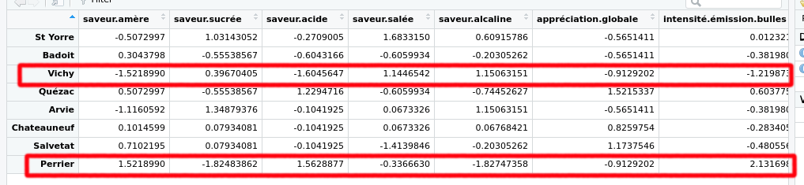
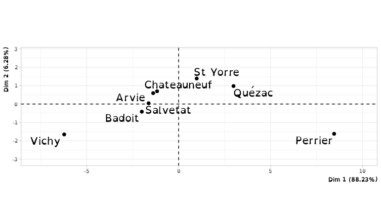
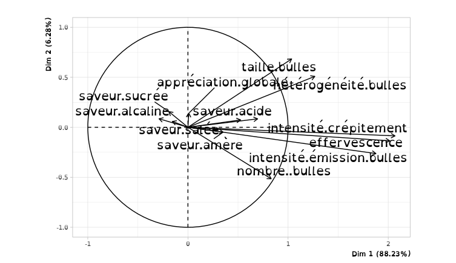
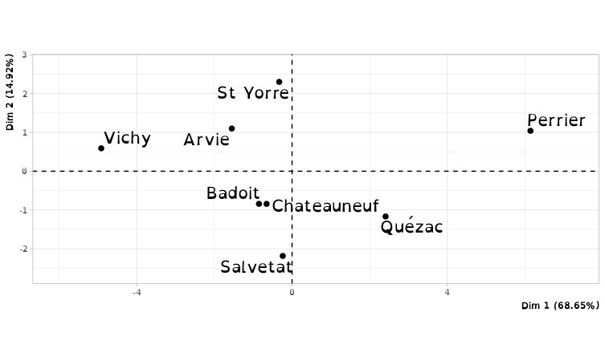
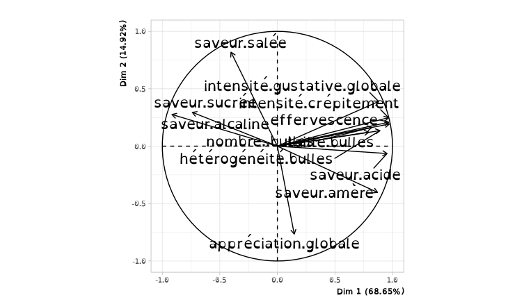

# Rendu TP1 : Apprentissage non supervisé

## Analyse en composantes principales

On centre les données pour gardé leurs variation et non leurs valeurs absolutes.

Sur la matrice de corrélation on vois que les saveurs alcaline et sucrée indique une caractéristique commune et que l'acide et l'amère une caractéristique proche. A l'inverse la relation entre les saveurs amère et sucrée, amère et alcaline, acide et alcaline indique des caractéristique très distinctes.

La matrice des distances entre les individus nous indique les individue qui on les données les moins similaire. Par exemple Vichy et Perrier sont très différent avec une valeur de `14.7`. On peut le vérifié directement dans les données brut. 

Pour l'ACP :

- Sur la figure des individus on vois des individues groupé au centre et quelque individu éloigné. 
- Sur la figure des variables on vois que des vecteurs sorte du cercle °~°. 

Pour l'ACP normé :

- Sur la figure des individus on vois que les individues sont plus dispersé mais quelque individu rest éloigné comme `Vichy` et `Perrier`. 

- Sur la figure des variables on vois que des vecteurs ne sorte plus du cercle °~°. 

TODO:

Le chois entre l'ACP et l'ACP normé ce fait on fonction de si on veut gardé ou non des variables. L'ACP normé donne le même pois à toute les variables.
