# Rendu TP1 : Apprentissage non supervisé

## Analyse en composantes principales

On centre les données pour gardé leurs variation et non leurs valeurs absolutes.

Sur la matrice de corrélation on vois que les saveurs alcaline et sucrée indique une caractéristique commune et que l'acide et l'amère une caractéristique proche. A l'inverse la relation entre les saveurs amère et sucrée, amère et alcaline, acide et alcaline indique des caractéristique très distinctes.

La matrice des distances entre les individus nous indique les individue qui on les données les moins similaire. Par exemple Vichy et Perrier sont très différent avec une valeur de `14.7`. On peut le vérifié directement dans les données brut.

### Pour l'ACP

- Sur la figure des individus on vois des individues groupé au centre et quelque individu éloigné.

- Sur la figure des variables on vois que des vecteurs sorte du cercle °~°.

### Pour l'ACP normé

- Sur la figure des individus on vois que les individues sont plus dispersé mais quelque individu rest éloigné comme `Vichy` et `Perrier`.

- Sur la figure des variables on vois que des vecteurs ne sorte plus du cercle °~°.

### Choix du nombre de composantes à retenir

Avec la règle de Kaiser ont garde `3` composantes car les 3 premier valeurs propre sont supérieur à `1`.

Les valeurs propres sont nommé $λ_d$ avec $d$ la dimension (c'est la variance empirique).
La valeur propre par dimension :

- Avec `1` composante on couvre `68.65%` des données significative et une valeur propre de $λ_1=8.9$.
- Avec `2` composantes on couvre `83.57%` des données significative et une valeur propre de $λ_2=1.9$.
- Avec `3` composantes on couvre `94.77%` des données significative et une valeur propre de $λ_3=1.5$.
- Avec `4` composantes on couvre `97.73%` des données significative et une valeur propre de $λ_4=0.3$.

Avec la règle du coude ont garde `2` composantes.
Visuellement on vois que la cassure est des la `2`éme composent.

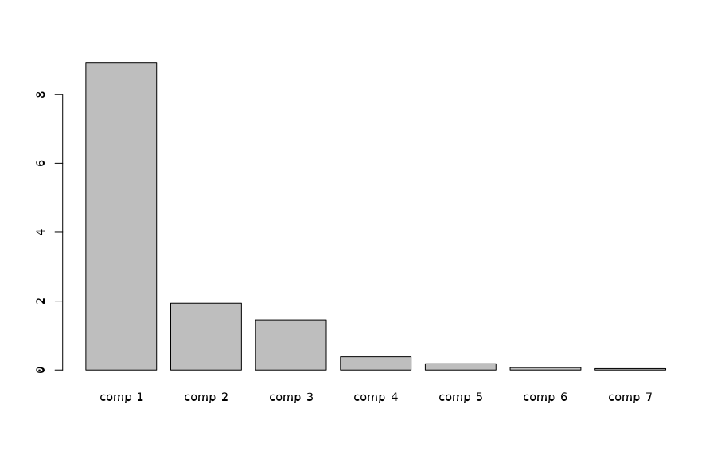

Par le calcule on tombe sur 2 aussi, on arrête le calcule dés que $δ_x$ est négatif puis on compte le nombre de $δ_x$.

Calcule des différences premières :

- $ε_1 = (λ_1-λ_2), ε_2 = (λ_2-λ_3), ε_3 = (λ_3-λ_4)$
- $ε_1 = (8.92-1.93), ε_2 = (1.93-1.45), ε_3 = (1.45-0.38)$
- $ε_1 = 7.99, ε_2 = 0.48, ε_3 = 1.07$

Calcule des différence secondes:

- $δ_1 = (ε_1-ε_2), δ_2 = (ε_2-ε_3)$
- $δ_1 = (7.99-0.48), δ_2 = (0.48-1.07)$
- $δ_1 = 7.51, δ_2 = -0.59$

On a une bonne qualité de la projection et contribution des individus avec `3` dimensions car ils contribuent tous à plus de `71%`, ce qui est mieux que `2` dimensions où la contribution la plus basse est de `55%` :

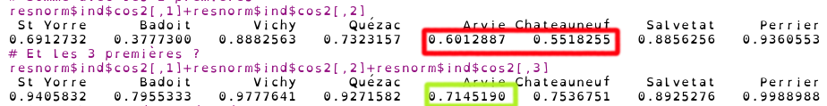

On a une bonne qualité de la projection et contribution des variables avec `3` dimensions car elles contribuent tous à plus de `84%`, ce qui est mieux que `2` dimensions où la contribution la plus basse est de `60%` :

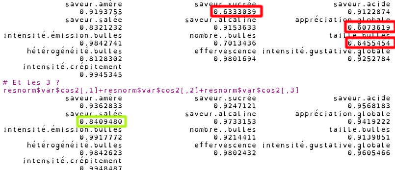

## Partitionnement

Les individues sont mieux répartie pour visuellement voire les clusters avec le `k-mean` brute.

`K-mean` sur les données brute :

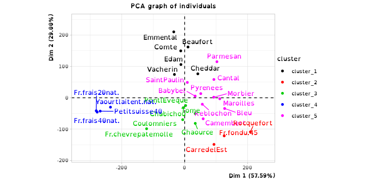

`K-mean` sur les données centrées-réduites :

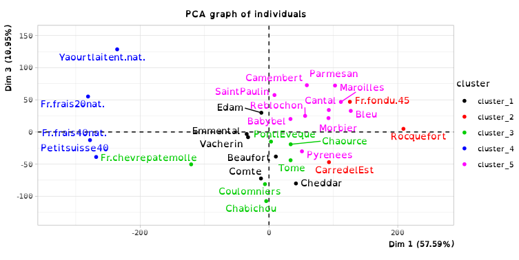

On distingue mieux les variables avec le `K-mean` centrées-réduites.

`K-mean` sur les données brute :

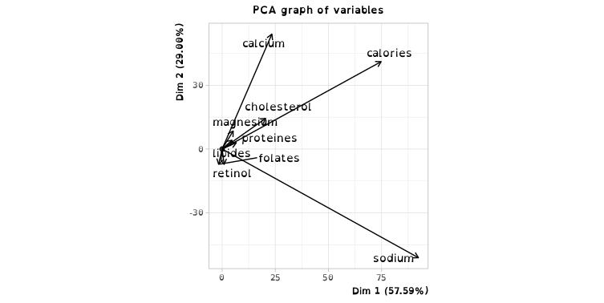

`K-mean` sur les données centrées-réduites :

## Partitionnement hiérarchique (distance de Ward)

Le découpage est plus distinct avec les données centrées-réduites.

Classification hiérarchique de Ward sur les données brutes :

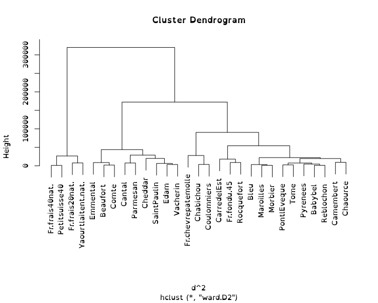

Classification hiérarchique de Ward sur les données centrées-réduites :

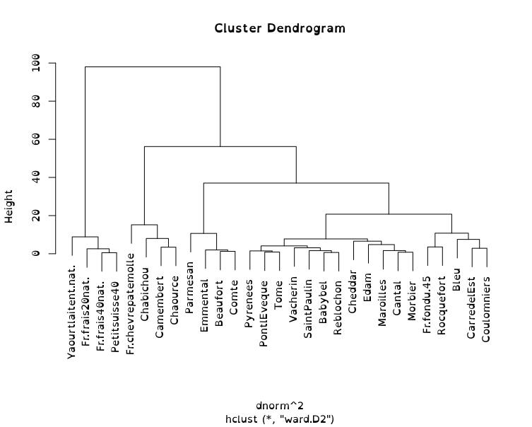

Avec la `distance de Ward` sur les données centrées-réduites on vois que les cluster sont mieux répartie et définit.

`distance de Ward` sur les données brute :

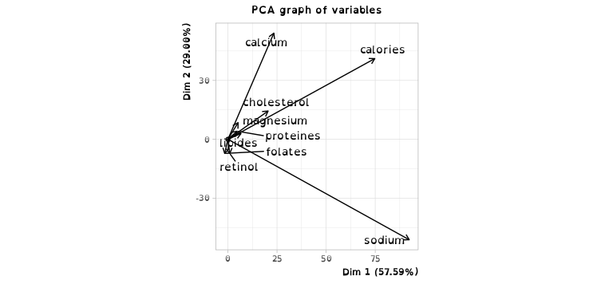
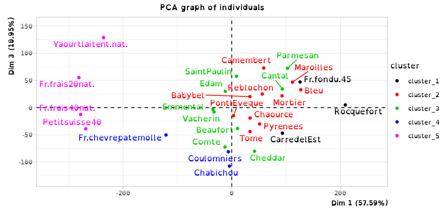
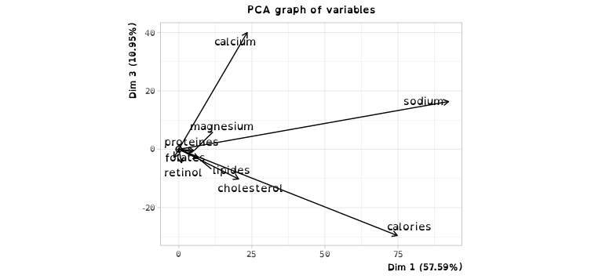

`distance de Ward` sur les données centrées-réduites :

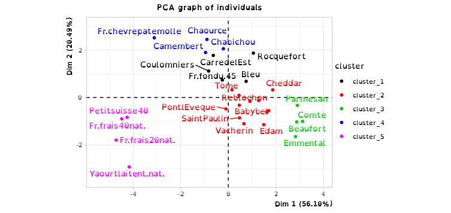
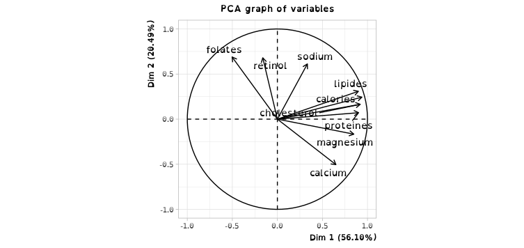
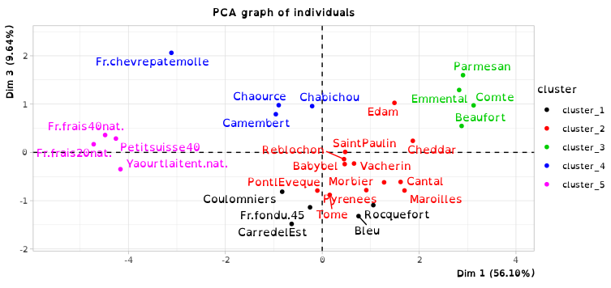
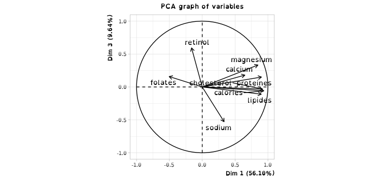
