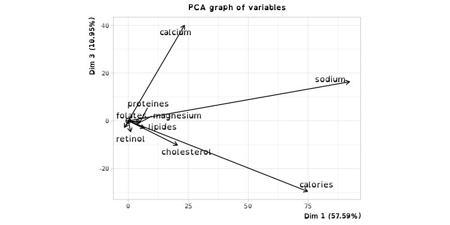
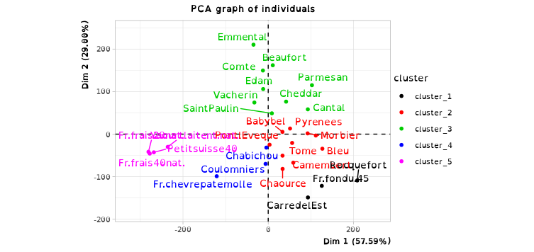

# Rendu TP1 : Apprentissage non supervisé

## Analyse en composantes principales

On centre les données pour garder leurs variations et non leurs valeurs absolues.

Sur la matrice de corrélation, on voit que les saveurs `alcaline` et `sucrée` indiquent une caractéristique commune et que l'`acide` et l'`amère` indiquent une caractéristique proche. À l'inverse la relation entre les saveurs `amère` et `sucrée`, `amère` et `alcaline`, `acide` et `alcaline` indique des caractéristiques très distinctes.

La matrice des distances entre les individus nous indique les individus qui on les données les moins similaires. Par exemple, `Vichy` et `Perrier` sont très différentes avec une valeur de `14.7`. On peut le vérifier directement dans les données brutes.

### Pour l'ACP

- Sur la figure des individus, on voit des individus groupés au centre et quelques individus éloignés.

- Sur la figure des variables, on voit que des vecteurs sorte du cercle °~°.

### Pour l'ACP normé

- Sur la figure des individus, on voit que les individus sont plus dispersé, mais quelques individus restent éloigné comme `Vichy` et `Perrier`.

- Sur la figure des variables, on voit que des vecteurs ne sortent plus du cercle °~°.

### Choix du nombre de composantes à retenir

Avec la `règle de Kaiser` ont garde `3` composantes, car les `3` premières valeurs propres sont supérieur à `1`.

Les valeurs propres sont nommées $λ_d$ avec $d$ la dimension (c'est la variance empirique).
La valeur propre par dimension :

- Avec `1` composante on couvre `68.65%` des données significative et une valeur propre de $λ_1=8.9$.
- Avec `2` composantes on couvre `83.57%` des données significative et une valeur propre de $λ_2=1.9$.
- Avec `3` composantes on couvre `94.77%` des données significative et une valeur propre de $λ_3=1.5$.
- Avec `4` composantes on couvre `97.73%` des données significative et une valeur propre de $λ_4=0.3$.

Avec la règle du coude ont garde `2` composantes.
Visuellement, on voit que la cassure est dès la `2`ème composent.

Par le calcul, on tombe sur `2` aussi, on arrête le calcul dès que $δ_x$ est négatif puis on compte le nombre de $δ_x$.

Calcule des différences premières :

- $ε_1 = (λ_1-λ_2), ε_2 = (λ_2-λ_3), ε_3 = (λ_3-λ_4)$
- $ε_1 = (8.92-1.93), ε_2 = (1.93-1.45), ε_3 = (1.45-0.38)$
- $ε_1 = 7.99, ε_2 = 0.48, ε_3 = 1.07$

Calcule des différences secondes :

- $δ_1 = (ε_1-ε_2), δ_2 = (ε_2-ε_3)$
- $δ_1 = (7.99-0.48), δ_2 = (0.48-1.07)$
- $δ_1 = 7.51, δ_2 = -0.59$

On a une bonne qualité de la projection et contribution des individus avec `3` dimensions, car ils contribuent tous à plus de `71%`, ce qui est mieux que `2` dimensions où la contribution la plus basse est de `55%` :

On a une bonne qualité de la projection et contribution des variables avec `3` dimensions, car elles contribuent tous à plus de `84%`, ce qui est mieux que `2` dimensions où la contribution la plus basse est de `60%` :

## Partitionnement

Les individus sont mieux répartis pour visuellement voire les clusters avec le `k-mean` brute.

`K-mean` sur les données brute :

`K-mean` sur les données centrées-réduites :

On distingue mieux les variables avec le `K-mean` centrées-réduites.

`K-mean` sur les données brute :

`K-mean` sur les données centrées-réduites :

## Partitionnement hiérarchique (distance de Ward)

Le découpage est plus distinct avec les données centrées-réduites.

Classification hiérarchique de Ward sur les données brutes :

Classification hiérarchique de Ward sur les données centrées-réduites :

Avec la `distance de Ward` sur les données centrées-réduites, on voit que les clusters sont mieux répartie et définit.

`distance de Ward` sur les données brute :

`distance de Ward` sur les données centrées-réduites :

