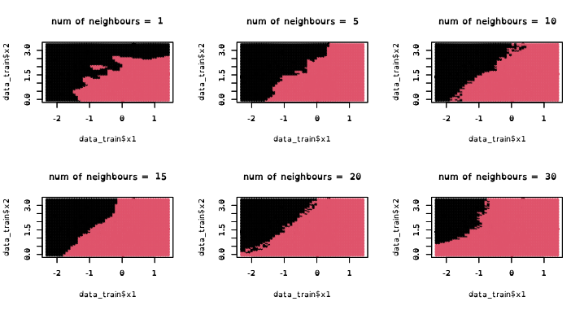

# TP3 : Apprentissage supervisé (Classification)

## Classification - Approches de type prototype

### Méthode des k-plus proches voisins (knn)

Sur la première prediction `knn` avec `10` voisins on obtiens un taux d'erreurs de `0.06`.
Quand on refait la prédiction avec les données de `test` on on obtiens un taux d'erreurs de `0.085`. On vois bien les erreurs sur le graphique (les triangles).

Dans le cas de patients malades il vaux mieux de faux positifs.
Dans notre cas on as pas de faut positifs mais `17` faux négatifs, donc 17 personnes malades non identifié.

On a une sensibilité (TPR : taux de vrais positifs) de `0.73`, $TPR=(TP/(TP+FN))$, ce qui signifie qu'on loupe des patients malades `0.27`.
On a une spécificité (TNR : taux de vrais négatif) de `1`, $TNR=(TN/(TN+FP))$, ce qui signifie qu'on ne considère aucun patients sain comme étant malade.
Notre précision (PPV : positive predictive value) est de `1`, $PPV = TP/(TP+FP)$, ce qui signifie que parmi les patients qu'on à prédit malade on est certain qu'il sont tous malade (si on avait eu `0.5` on serai sùr que seulement la moitié serai bien malade).
La prévalence est de `0.31`.
La `F-measure` (`F-score`) est `0.8411215`.

Je pense que quand on as seulement un seul voisin on cole mieux aux données mais la prediction est mauvaise car on a peut de marge de maneuver. Et quand il y a trop de voisins on perd trop en précision.
Plus on prend de voisins en compte plus la frontière englobe des patients malades dans les patients sain (Plus on à de faux positifs).
Pour choisir `k` on fait varier `k` de `0` à `10` car on vois sur le graphique que quand `k` est plus grand que 10 on perd en précision. Puis on calcule pour chaque `k` le `knn` sur des données d’entraînement et de test et on calcule le taux d'erreurs de prédiction. On choisi ensuite le `k` qui minimise le taux d'erreurs. On vois avec la `Confusion Matrix` que le `k` qui minimise le taux d'erreurs minimise le nombre de faux négatifs.

TODO: 12.

### Arbres de classification

### Forêts aléatoires

## Classification - Approches basées sur un modèle

### Analyse discriminante linéaire et quadratique

### Bayésien naif

### Régression logistique

