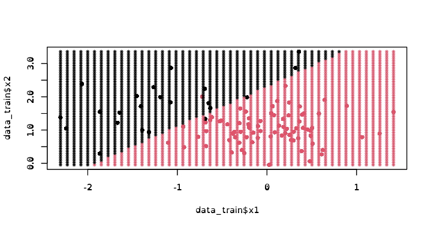

# TP3 : Apprentissage supervisé (Classification)

## Classification - Approches de type prototype

### Méthode des k-plus proches voisins (knn)

Sur la première prédiction `knn` avec `10` voisins on obtient un taux d'erreurs de `0.06`.Quand on refait la prédiction avec les données de `test` on obtient un taux d'erreurs de `0.085`. On voit bien les erreurs sur le graphique (les triangles).

Dans le cas de patients malades, il vaut mieux de faux positifs.
Dans notre cas, on n'a pas de faux positifs, mais `17` faux négatifs, donc 17 personnes malades non identifiées.

On a une sensibilité (TPR : taux de vrais positifs) de `0.73`, `TPR=(TP/(TP+FN))`, ce qui signifie qu'on loupe des patients malades `0.27`.
On a une spécificité (TNR : taux de vrais négatif) de `1`, `TNR=(TN/(TN+FP))`, ce qui signifie qu'on ne considère aucun patient sain comme étant malade.
Notre précision (PPV : positive predictive value) est de `1`, `PPV = TP/(TP+FP)`, ce qui signifie que parmi les patients qu'on a prédit comme étant malade on est certain qu'il sont tous malade (si on avait eu `0.5` on serait sûr que seulement la moitié serai bien malade).
La prévalence est de `0.31`.
La `F-measure` (`F-score`) est `0.8411215`.

Je pense que, quand on a seulement un seul voisin on colle mieux aux données, mais la prédiction est mauvaise, car on a peu de marge de manœuvre. Et quand il y a trop de voisins, on perd trop en précision.
Plus on prend de voisins en compte plus la frontière englobe des patients malades comme étant des patients sain (Plus de faux positifs).
Pour choisir `k` on fait varier `k` de `0` à `10`, car on voit sur le graphique que quand `k` est plus grand que `10`, on perd en précision. Puis on calcule pour chaque `k` le `knn` sur des données d’entraînement et de test et on calcule le taux d'erreurs de prédiction. On choisi ensuite le `k` qui minimise le taux d'erreurs. On vois avec la `Confusion Matrix` que le `k` qui minimise le taux d'erreurs minimise le nombre de faux négatifs.

Dans ce cas le `k` qui minimise le taux d'erreurs est égale à `3`.

La matrice de confusion de cette méthode est :

|  | 1  | 2  |
|--|:--:|:--:|
|1 | 55 | 2  |
|2 | 7  | 136|

Le taux d'erreurs avec les données des test est de `0.045`.

Avec la courbe `ROC` et grâce au calcul, on détermine que le meilleur seuil est `0.7`.

### Arbres de classification

> méthode CART

La matrice de confusion de cette méthode est :

|  | 1  | 2  |
|--|:--:|:--:|
|1 | 25 | 1  |
|2 | 37 | 137|

Le taux d'erreurs avec les données des test est de `0.19`

Avec l'arbre complet, on obtient le graphique des cross validation suivant :

### Forêts aléatoires

La matrice de confusion de cette méthode est :

|  | 1  | 2  |
|--|:--:|:--:|
|1 | 54 | 2  |
|2 | 8  | 136|

Le taux d'erreurs avec les données des test est de `0.05`.

L'algorithme de forêt aléatoire est mieux que la méthode `CART`, mais légèrement moins bien que `k-plus`.

## Classification - Approches basées sur un modèle

### Analyse discriminante linéaire et quadratique

#### LDA

La matrice de confusion de cette méthode est :

|  | 1  | 2  |
|--|:--:|:--:|
|1 | 52 | 1  |
|2 | 10 | 137|

Le taux d'erreurs avec les données des test est de `0.055`.

#### QDA

La matrice de confusion de cette méthode est :

|  | 1  | 2  |
|--|:--:|:--:|
|1 | 53 | 1  |
|2 | 9  | 137|

Le taux d'erreurs avec les données des test est de `0.05`.

#### LDA vs QDA

Frontières de décision :

On voit que `QDA` convient un peu plus à notre problématique que `LDA`, car `QDA` suis plus la distribution des données.

### Bayésien naif

La matrice de confusion de cette méthode est :

|  | 1  | 2  |
|--|:--:|:--:|
|1 | 52 | 0  |
|2 | 10 | 137|

Le taux d'erreurs avec les données des test est de `0.05`.

Frontière de décision :

### Régression logistique

La matrice de confusion de cette méthode est :

|  | 1  | 2  |
|--|:--:|:--:|
|1 | 52 | 2  |
|2 | 10 | 136|

Le taux d'erreurs avec les données des test est de `0.06`.

Frontière de décision :

