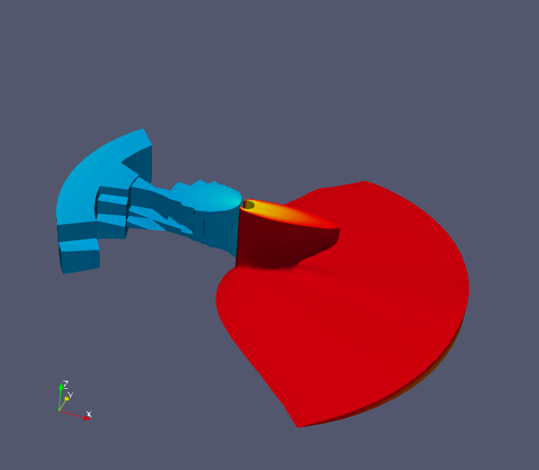
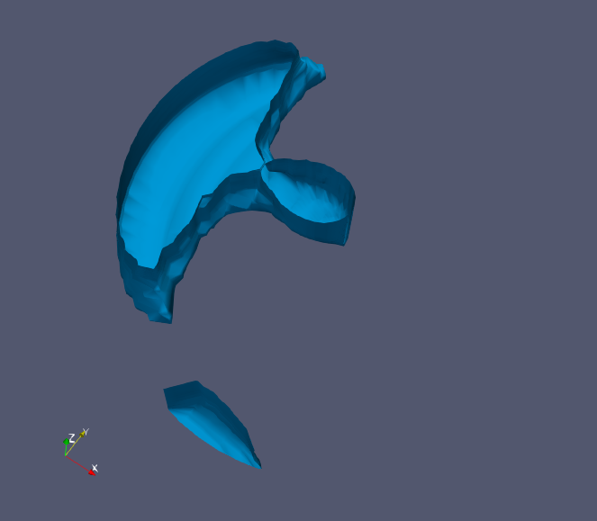

# TP1 visu

## Links

<https://julien-tierny.github.io/visualizationExerciseParaView.html>

## Domain visualization

### Question 1

- done.
- done.

Shows the boundary of our volume.

### Question 2

The employed shading model is "Gouraud". C'est un type d'interpolation. ça ne fonctionne pas car il manque les normales.

### Question 3

The missing informations is the normals.

### Question 4

### Question 5

### Question 6

### Question 7

### Question 8

### Question 9

### Question 10

### Question 11

### Question 12

### Question 13

### Question 14

en rouge un `iso volume` (filtre `iso volume`).
en bleu un `interval` (filtre `threshold`).

en bleu clair une `iso surface` (filtre `contour`).

### Question 15

### Question 16

### Question 17

### Question 18

### Question 19

### Question 20

### Question 21

### Question 22

### Question 23

### Question 24

### Question 25

### Question 26
