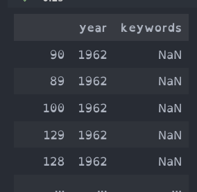
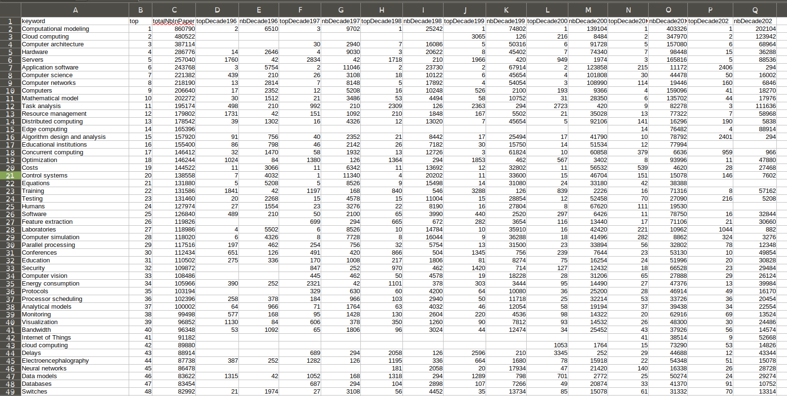
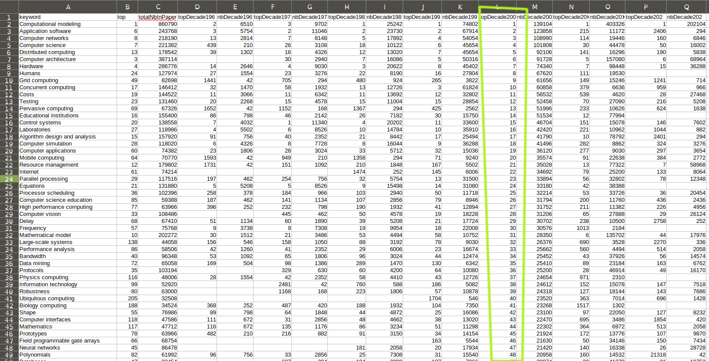
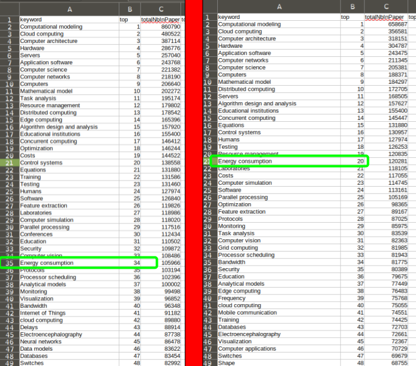
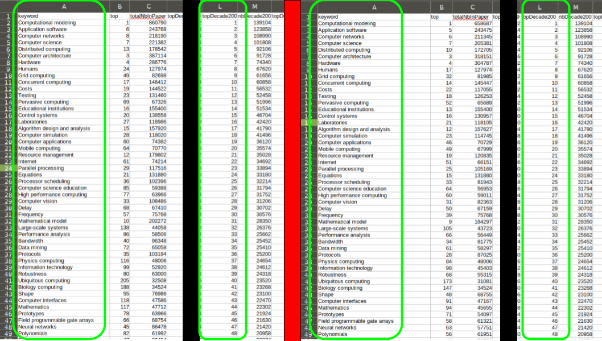
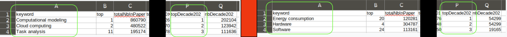

# Rendu TP2

## 1. Top 10 des mots-clefs

En analysant les donnés, j'ai vu qu'il n'y a pas de mots-clefs pour certains articles. J'ai décidé de ne pas prendre en compte les articles sans mots-clefs.



Mon programme prend trois arguments : le fichier avec les métadonnées des articles, le dossier de sortie du top par décennies (`decadeTopOutput`) et le dossier de sortie du top globale (`keywordTopOutput`).

Exemple de commande de lancement du programme :

```bash
yarn jar topkeywords-0.0.1.jar /user/fzanonboito/CISD/IEEEdata.csv decadeTopOutput keywordTopOutput
```

Mon implémentation est composée de `2` jobs Map-Reduce, le premier `TopDecade` qui utilise `2` mappers et `1` reducer. Le second `TopKeyword` qui utilise `1` mappers et `1` reducer.

Le premier job récupère les mots-clefs et fait le top pour les décennies, pour cela, j'ai le mapper et le reducer suivant :

- Le mapper `RawDataMapper` traite les données en enlevant les lignes sans mots-clefs ou sans date et retourne en clef la décennie et en valeur un mot-clef. Pour calculé la décennie, je fais simplement une division stricte par 10 pour récupérer la décennie par rapport à l'an 0 (e.g. `1998 => 199`, `-212 => -21`), cette solution est inexacte pour les dates entre `-10` et `10`, car cela donne la décennie `0`, mais ce cas n'arrive pas dans nos données qui commencent à partir de l'année `1962`. Il peut y avoir plusieurs mapper de ce type en parallèle.

- Le reducer `DecadeReducer` compte pour chaque décennie le nombre de fois qu'un mot-clef apparaît puis fait le top de chaque mot-clef. La sortie de ce reducer est sous la forme d'une ligne CSV séparé par des points-virgules. Le premier élément est la décennie suivie du mot-clef puis du nombre de papier où il apparaît dans la décennie et pour finir le top dans la décennie. Les lignes de chaque décennie sont trillé du plus fréquent au moins fréquents puis par ordre alphabétique pour les mots-clefs par contre les décennies peuvent être dans n'importe quel ordre, mais tous les lignes d'une décennie se suive. Il peut y avoir plusieurs reducer de ce type en parallèle et chacun produit son propre fichier. Je garde le nombre de papier où apparaît le mot-clef pour permettre le top global.

Le second job récupère les données par décennies du job précédent pour faire le top global. Pour faire ce top, j'ai le mapper et le reducer suivant :

- Le mapper `DecadeMapper` vérifie que les données sont bien présente et que le nombre de papier est bien un entier, ensuite, il retourne en clef le mot-clef et en valeur le nombre de papier par décennie ainsi que la décennie en question et le top dans la décennie. Il peut y avoir plusieurs mapper de ce type en parallèle.

- Le reducer `KeywordReducer` fait la somme du nombre de papier pour chaque mot-clef, il regroupe aussi les données. Ensuite, il fait le top grâce à la somme totale. Ce reducer retourne les données sous la forme d'une ligne CSV séparée par des points-virgules. Cette ligne a pour éléments le mot-clef, le top global, le nombre global de papier ou apparaît le mot-clef ainsi que chaque top et nombre papier par décennie. J'ai décidé de mettre le top de chaque décennie dans le fichier final et donc de garder toutes les lignes de tous les mots. Je pense que se chois n'impacte pas les performances, mais juste la taille du fichier final. Je trouve qu'il est plus pratique de voir les tops de chaque décennie dans ce fichier, car il suffit de trier la colonne voulue. Les donnés sont trillé du mot-clef le plus fréquent aux moins fréquents puis par ordre alphabétique pour les mots-clefs. Il ne peut y avoir qu'un seul reducer de ce type, c'est nécessaire pour faire le top global.

Les données finales qu'on obtient :



Il est facile de trier le top d'une décennie en particulier. Par exemple avec les années `2000-2010` :



Exemple d'où visualiser le fichier de sortie :

```bash
hdfs dfs -cat keywordTopOutput/part-r-00000
```

## 2. Ajout de nouvelle données

Pour prendre en compte l'ajout de nouveau papier publié après la première exécution, j'ai ajouté un quatrième argument. Celui-ci permet de charger les données des décennies déjà calculées.

Par exemple avec la commande ci-dessous, on a les nouvelles données (`IEEE_Newdata.csv`) suivie des données déjà calculé (dans `decadeTopOutput`) puis le dossier qui recevra les décennies mis à jour et toujours le dossier de sortie final :

```bash
yarn jar topkeywords-0.0.1.jar IEEE_Newdata.csv decadeTopOutput decadeTopOutput_withNewData keywordTopOutput2
```

Pour que l'ajout de nouveau papier publié fonctionne, il faut ajouter un nouveau mapper (`ExistingDataDecadeMapper`) qui vas seulement charger les donnés déjà calculé. J'ai ajouté ce nouveau mapper au job `TopDecade` sur l'argument `decadeTopOutput` et on garde l'ancien mapper pour l'argument `IEEE_Newdata.csv`. J'utilise un `MultipleInputs` pour avoir plusieurs mappers sur le job `TopDecade`. J'ai aussi modifié le reducer `DecadeReducer` pour qu'il ignore les décennies déjà calculées.

J'ai créé un fichier `IEEE_Newdata.csv` avec des faux articles qui ont pour mots-clefs `Energy consumption`, `Hardware` et `Software`. Après l'exécution, on voit que le mots-clefs `Energy consumption` passe bien du top `34` au top `20` :



On voit que sur le top de la décennie `2000-2010` il n'y a pas eu de changement dans les données :



Pour finir, on voit que sur le top de la décennie `2020-2030` a bien été mis à jour :



## Mes tests

### La taille des données

J'ai calculé la taille des données auxquelles je m'attendé pour m'assurer du résultat.
Avec un script python, j'ai déterminé que le nombre de mots-clefs différant est `130364`. J’obtiens `130365` avec le compteur (`Reduce output records`) de mon reducer `KeywordReducer`, il y a une différence de `1` qui est du a une entête que j'écris dans le fichier de sortie.

J'ai aussi déterminé que le nombre de mots-clefs total (avec duplication) qui est `1060969`. J’obtiens `1060964` avec les compteurs (`Map output records` et `Reduce input records`) qui montrent les données qui passent du mapper `DecadeMapper` au reducer `KeywordReducer`, il y a une différence de `5` mais je n'ai pas trouvé pourquoi.

### Différant / performances

J'ai testé mon implémentation en augmentant artificiellement le nombre de papiers. Pour augmenter le nombre de papier, j'ai concaténé plusieurs fois le fichier `IEEEdata.csv` avec lui-même. Le fichier est passé de `123490` lignes à `5186580` lignes.
J'ai vu les différences suivantes :

- Le premier job `TopDecade` lis beaucoup plus de données et en écrit plus. Il utilise maintenant `49` tâches mapper et toujours `1` tâche reducer.
- Les données manipulées par le mapper et transmise au reducer sont bien plus nombreuse par contre le nombre de données en sortie du reducer `DecadeReducer` reste le même, car il y a toujours le même nombre de mots lié aux mêmes décennies.
- Le temps d'exécution est de `1`minute `21`secondes ce qui est `1`minute plus long que le temps d'exécution avec les données de base qui est `21`secondes. Quand j'augmente le nombre de tâches reducer le temps d'exécution diminue, il passe à `48`secondes avec `8` tâches (la différence avec les données de base est plus que de `27` secondes). Le fais d'augmenté le nombre de tâches fait peut augmenter le nombre d'octets écrit, mais augmente le nombre de fichiers. Ces augmentations ont un impact très faible sur le job suivant (`TopKeyword`), de moins d'une seconde pour `8` tâches.

> `NB_REDUCE_TASKS=8 yarn jar topkeywords-0.0.1.jar testIEEEdata.csv decadeTopOutput keywordTopOutput`

J'ai testé différant nombre de tâches reducer pour trouver le meilleur. Je n'ai fait qu'une seule exécution par nombre de tâches.

| nombre de tâches  | 1  | 6  | 8  | 10 | 12 | 14 | 16 | 18 | 20 | 48 |
|:------------------|:--:|:--:|:--:|:--:|:--:|:--:|:--:|:--:|:--:|:--:|
| temps en secondes | 81 | 54 | 48 | 38 | 38 | 36 | 36 | 35 | 34 | 39 |

Plus on a de tâches et plus le reducer `DecadeReducer` vas vite. La limite de ce gain de vitesse est certainement le nombre de mapper.

Le second job `TopKeyword` lis est écrit plus de données, car les valeurs sont plus grandes. Il utilise toujours `1` tâche mapper et `1` tâche reducer. Le temps d'exécution ne change pas est reste de `18`secondes. Quand on défini plus de reducer au job `TopDecade` il y a plus de fichiers donc plus de mapper, mais le temps d'exécution est le même.

### performances entre les représentation des données `IntWritalbe` et `Text`

J'ai comparais les représentations intermédiaire des données. J'ai vue une seul différance qui est le nombre d'octets écrit, `21` octets de plus avec la version integer.

Conteur du nombre d'octets écrit par le job `TopDecade`. Version Text à gauche et version Integer à droit :


Par-contre je n'ai pas vue de différance significatif sur la performance. Cette différance est du au fait que l'on écrits diréctement les entiés en binaire et non caractéres par caractéres, ce qui fait que les nombre qui on plus de 4 caractéres sont écrit sur 4 octets qu'il pourais rentré largement sur 4 octets en étant sous la form d'un int32. Donc avec plus de données il pourrais y avoir un impact sur les performance car plus d'octets serai écrite. J'ai seulement fait 4 run (2 pour la version text et 2 pour la version integer).

## Les limitations

Une limitation de ma solution est que je n'utilise pas de `combiner` ce qui pourrait faire diminuer le temps d'exécution.

Pour le cas où on veut ajouter de nouvelles donnés sans recalculer les anciennes, ma solution charge toute les donnés et copie dans le nouveau dossier de sortie certaine décennies qui ne sont pas modifiées ce qui peut amener à une perte de performance en lecture/écriture.
