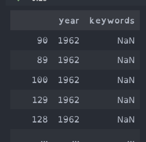

# TP2

## notes

`/user/fzanonboito/CISD/IEEEdata.csv`

## Data processing

### step 1 : top 10 keywords

En analysent les donnés j'ai vue qu'il n'y as pas de mots clef pour certains articles. J'ai décidé de drop les articles sans mots clef.

Mon programme prend trois arguments : le fichier avec les meta-données des articles, le dossier do sortie du top par décennies et le dossier de sortie du top globale.

Example de commande de lancement du program :

```bash
yarn jar topkeywords-0.0.1.jar /user/fzanonboito/CISD/IEEEdata.csv decadeTopOutput keywordTopOutput
```

Ma solution est divisé en 2 job.
Mon implémentation est composé de `2` jobs Map-Reduce, le premier `TopDecade` qui utilise `2` mappers et `1` reducer. Le second `TopKeyword` qui utilise `1` mappers et `1` reducer.

Le premier job récupère les mots clef et fait le top pour les décennies, pour cela j'ai le mapper et le reducer suivant :

- Mon mapper `RawDataMapper` traite les données en enlevents les lignes sans mots clef ou sans date et retourne en clef la décennies et en valeur un mots clef. Pour calculé la décennie je fais simplement une division sctricte par 10 pour récupéré la décennies par rapport a l'ans 0 (e.g. 1998 => 199, -212 => -21), cette solution est inexacte pour les date entre `-10` et `10` car cela donne la décennie `0` mais ce cas n'arrive pas dans nos données qui commance à partire de l'année `1962`. Il peut y avoir plusieurs mapper de ce type en parallel.



- Mon réduceur `DecadeReducer` compte pour chaque décennies le nombre de fois qu'un mots clef apparé puis fait le top de chaque mots clef. La sortie de ce réducer est sous la forme d'une ligne CSV séparé par des points virgule. Le premié élément est la décennie suivie du mots clef puis du nombre de papier ou il apparé dans la décennie et pour finir le top dans la décennie. Les lignes de chaque décennies sont trillé du plus féquant aux moins frécant puis par ordre alphabetique pour les mots clef par-contre les décennies peuvet être dans n'importe quelle ordre mais toute les linges d'une décennie ce suive. Il peut y avoir plusieurs reducer de ce type en parallel et chacun produit sont propre fichier. Je garde le nombre de papier où apparé le mot clef pour permetre le top global.

Le second job récupère les données par décennies du job précédent pour faire le top global. Pour faire ce top j'ai le mapper et le reducer suivant :

- Mon mapper `DecadeMapper` vérifie que les données sont bien présente et que nombre de papier est bien un entier ensuite il retourne en clef le mots clef et en valeur le nombre de papier par décennie ainsi que la décennie en question et le top dans la décennie. Il peut y avoir plusieurs mapper des ce type en parallel.

- Mon réduceur `KeywordReducer` fait la some du nombre de papier pour chaque mots clef, il regroupe aussi les données. Ensuiste il fait le top grace à la some total. Ce réducer retourne les donnée sous la forme d'une ligne CSV séparé par des points virgule. Cette ligne à pour éléments le mots clef, le top glibale, le nombre globale de papier ou apparé le mots ainsi que que chaque top et nomber papier par décennie. J'ai decidé de mettre le top de chaque décennie dans le fichier final et donc de gardé toute les lignes de tous les mots. Je pense que ce chois n'impacte pas les performance mais juste la taille du fichier final. Je touve qu'il est plus pratique de voire les top de chaque décennie dans ce fichier car il suffie de trillé la colonne voulue. Les donnés sont trillé du plus féquant aux moins frécant puis par ordre alphabetique pour les mots clef. Il peut y avoir qu'**un** seul reducer de ce type, c'est néssaisaire pour faire le top.

Example de où visualisé le fichier de sortie :

```bash
hdfs dfs -cat keywordTopOutput/part-r-00000
```

### step 2 : add new data

Pour prendre en compte l'ajout de nouveau papier publié après la première execution j'ai ajouté un quatième argument. Celui-ci permet de chargé les données des décennies déjà calculé.

Par example avec la commande si dessous on à les nouvelle donnés (`IEEE_Newdata.csv`) suivie des données déjà calculé (dans `decadeTopOutput`) puis le dossier qui recevra les décennies mis à jour et toujours le dossier de sortie final :

```bash
yarn jar topkeywords-0.0.1.jar IEEE_Newdata.csv decadeTopOutput decadeTopOutput_withNewData keywordTopOutput
```

Pour que cela fontionne il faut ajouté un mapper qui fait que chargé les donnés déjà calculé en plus des nouvlle donnés. Le reste devais fonctionné correctement.


TODO: do the modification. `decadeTopOutput_withNewData`.

## Report

### the expected size

J'ai calculé la taille des données aux quelle je m'attendé pour m'assuré du résultat.
Avec un script python j'ai déterminé que le nombre de mots clef différant est `130364`. J’obtiens `130365` avec le compteur (Reduce output records) de mon reducer `KeywordReducer`, il y à une différance de `1` car j'écrit une entéte dans le fichier de sortie.

J'ai aussi déterminé que le nombre de mots clef total (avec duplication) qui est `1060969`. J’obtiens `1060964` avec les compteurs (Map output records et Reduce input records) qui montre les données qui passe du mapper `DecadeMapper` au reducer `KeywordReducer`, il y à une différance de `5` mais je n'ai pas trouvé pourquoi.

### différant / perfs

J'ai testé mon implémentation en augmentent artificiellement le nombre de papiers. Pour augmenté le nombre de papiés j'ai concaténé plusieurs fois le fichier `IEEEdata.csv` avec lui même. Le fichier est passé de `123490` lignes à `5186580` lignes.
J'ai vue (la diff)
Le premier job `TopDecade` lis beaucoup plus de données et en écrit plus. Il utilise maintenant `49` tâches mapper et toujours `1` tâche reducer. Les données manipulé par le mapper et transmi au reducer sont bien plus nombreuse par-contre le nombre de données en sortie du reducer `DecadeReducer` reste le même car il y à toujours le même nombres de mots lié au même décennie. Le temp d'éxécution est de `1`minute `21`secondes ce qui est `1`minute plus long que le temp d'éxécution avec les données de base qui est `21`secondes. Quand j'augmente le nombre de tâches reducer le temps d'éxécution diminue, il passe à `48`secondes avec `8` tâches (la différance avec les données de base est plus que de `27` secondes). le fait d'augmenté le nombre de tâches fait peut augmenté le nombre d'octets écrit mais augmente le nombre de fichiers. Ces augmentation on un impacte très faible sur le job suivant (`TopKeyword`), de moins d'une secondes pour `8` tâches.

> `NB_REDUCE_TASKS=8 yarn jar topkeywords-0.0.1.jar testIEEEdata.csv decadeTopOutput keywordTopOutput`

J'ai testé différant nombres de tâches reducer pour trouvés le mailleur. J'ai fait qu'une seul éxécution par nombre.

| nombre de tâches  | 1  | 6  | 8  | 10 | 12 | 14 | 16 | 18 | 20 | 48 |
|:------------------|:--:|:--:|:--:|:--:|:--:|:--:|:--:|:--:|:--:|:--:|
| temps en secondes | 81 | 54 | 48 | 38 | 38 | 36 | 36 | 35 | 34 | 39 |

Plus on à de tâches et plus le reducer `DecadeReducer` vas vite. La limite de ce gain de vitésse est certainement le nombre de mapper.

Le second job `TopKeyword` lis est écrit plus de données car les valeurs sont plus grandes. Il utilise toujours `1` tâche mapper et `1` tâche reducer. Le temp d'éxécution ne change pas est reste de `18`secondes. Quand on défini plus de reducer au job `TopDecade` il y a plus de fichiers donc plus de mapper mais le temps d'éxécution est le même.

### perf int text

J'ai comparais les représentations intermédiaire des données. J'ai vue une seul différance qui est le nombre d'octets écrit, `21` octets de plus avec la version integer.

Conteur du nombre d'octets écrit par le job `TopDecade`. Version Text à gauche et version Integer à droit :


Par-contre je n'ai pas vue de différance significatif sur la performance. Cette différance est du au fait que l'on écrits diréctement les entiés en binaire et non caractéres par caractéres, ce qui fait que les nombre qui on plus de 4 caractéres sont écrit sur 4 octets qu'il pourais rentré largement sur 4 octets en étant sous la form d'un int32. Donc avec plus de données il pourrais y avoir un impact sur les performance car plus d'octets serai écrite. J'ai seulement fait 4 run (2 pour la version text et 2 pour la version integer).

### limitations

Une limitation de ma solution est que je n'utilise pas de combiner ce qui pourrais faire diminué le temps d'exécution.

Pour le cas ou on veux ajouté de nouvelles donnés sans recalculé les ancienne, ma solution charge toute les donnés et copie dans le nouveaux dossier de sortie certaine décennies qui ne sont pas modifié ce qui peut amené a une perte de performance en lecture / écriture.
