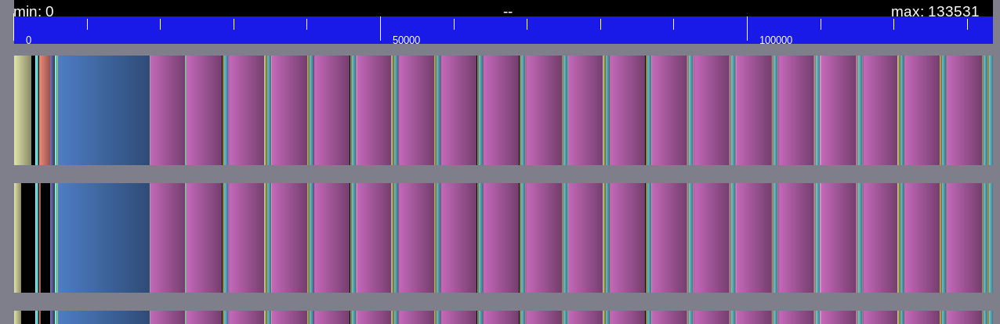
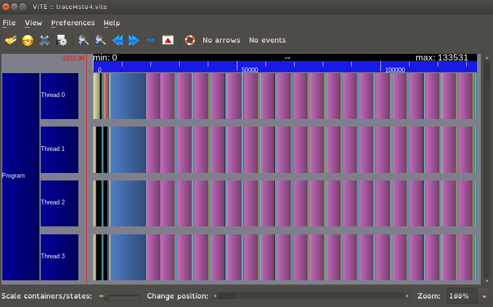
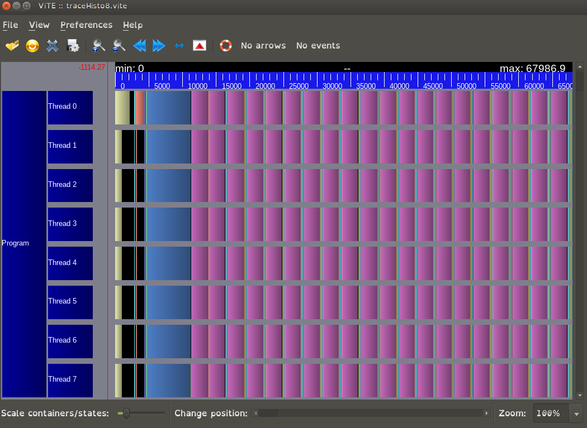
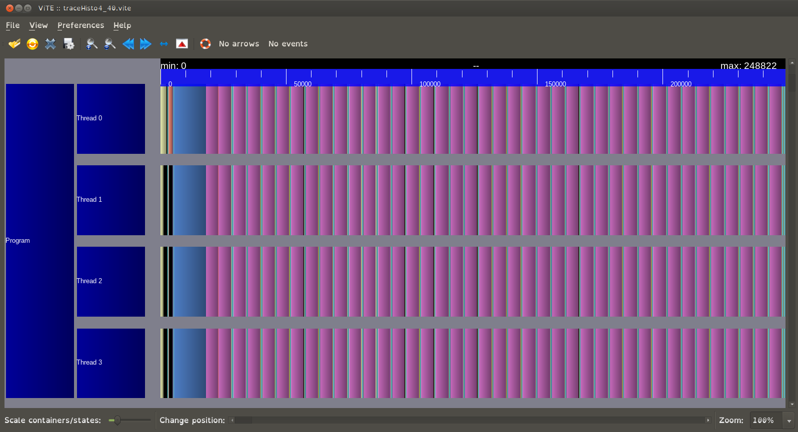
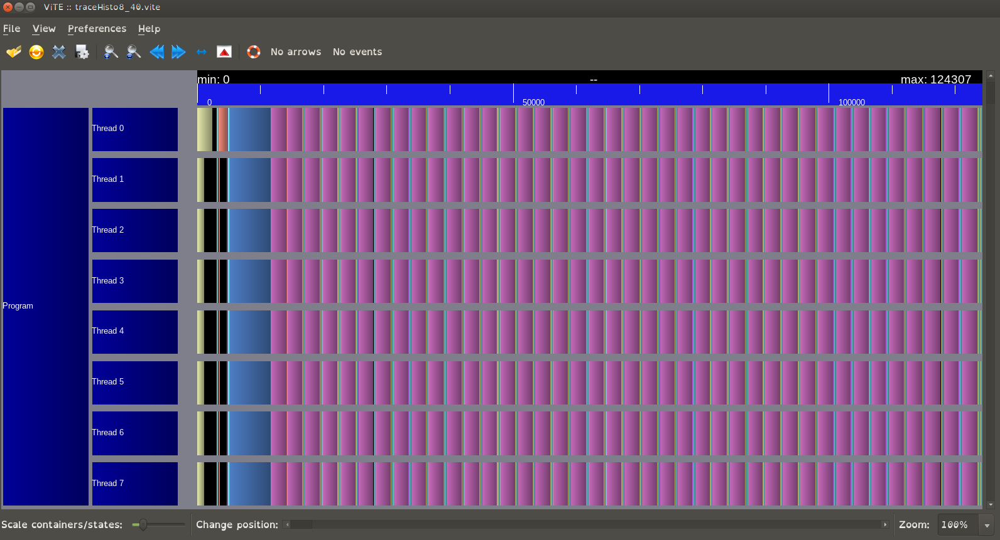

# Traitement in-situ TP1

## Init env & build

```bash
$HOME/projects/TPs_In_Situ/exaStamp/scripts/configure-plafrim.sh
```

> build path : `/home/cisd-goedefr/projects/TPs_In_Situ/build`

```bash
cd $HOME/projects/TPs_In_Situ/build
source setup-env.sh
salloc -proutage -n1 -c12 make -j24
```

## seq exec

```bash
salloc -proutage -n1 -c1 /bin/env OMP_NUM_THREADS=1 \
$HOME/projects/TPs_In_Situ/build/xstampv2 tutorial_insitu_histo_par.msp
```

```bash
salloc -proutage -n1 -c1 /bin/env OMP_NUM_THREADS=1 \
$HOME/projects/TPs_In_Situ/build/xstampv2 tutorial_insitu_histo_par.msp \
--profiling-vite trace.vite
```

```bash
salloc -proutage -n1 -c4 /bin/env OMP_NUM_THREADS=4 \
$HOME/projects/TPs_In_Situ/build/xstampv2 tutorial_insitu_histo_par.msp \
--profiling-vite trace.vite
```

```bash
salloc -proutage -n1 -c4 /bin/env OMP_NUM_THREADS=4 $HOME/projects/TPs_In_Situ/build/xstampv2 \
tutorial_insitu_histo_seq.msp --profiling-vite trace.vite --profiling-summary
```

## Exercice 1

1.1. j'ai changer de 50 à 500.
1.2. je vois qu'il c'est bien répartie sur tous les threads.
1.3. On vois que audela d'un certain nombre de coeurs on a beaucoup d'attente (la loi d'amdale)
1.3bis. oui plus ou moins.

## Exercice 2

2.1. c'est fait sur 2 boucle d'on une avec 2 reduction sur `min_val` et `max_val`.
2.2. c'est fait avec 8 traces sur les quelle on vois que `histogram_energy` est divisé sur chaque threads.

## Exercice 3

```bash
salloc -proutage -n1 -c4 /bin/env OMP_NUM_THREADS=4 \
$HOME/projects/TPs_In_Situ/build/xstampv2 tutorial_insitu_histo2_par_freq.msp --profiling-vite traceHisto4.vite
```

3.1. `20` analyses vont être exécutées, à un fréquence de `1`.

```txt
  simulation_end_iteration: 20
  simulation_log_frequency: 1
```



3.2. Je constate qu'il y a un gain de performances.




3.3. Je vois que plus on à de threads plus la simulation vas vite.




3.4. Tous programs qui tournerez en même temps sur la machine.
