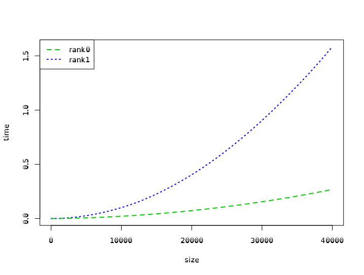

# TP1 MPI

## Exercice 0

`mpicc -show` me donne :

> Sur mon pc

```txt
gcc -I/usr/lib/x86_64-linux-gnu/openmpi/include/openmpi -I/usr/lib/x86_64-linux-gnu/openmpi/include -pthread -L/usr/lib/x86_64-linux-gnu/openmpi/lib -lmpi
```

> Sur PLAFrim `module load mpi/openmpi/3.1.4-all`

```txt
gcc -I/cm/shared/modules/generic/mpi/openmpi/3.1.4-all/include -pthread -Wl,-rpath -Wl,/cm/shared/modules/generic/mpi/openmpi/3.1.4-all/lib -Wl,--enable-new-dtags -L/cm/shared/modules/generic/mpi/openmpi/3.1.4-all/lib -lmpi
```

## Exercice 1

> `mpicc rankSize.c -o rankSize`

```bash
mpirun rankSize
Rank 2 pour 4 nodes
Rank 3 pour 4 nodes
Rank 0 pour 4 nodes
Rank 1 pour 4 nodes
```

## Exercice 2

```bash
mpirun rankSize
Rank pairs 1 pour 4 nodes
Rank impairs 2 pour 4 nodes
Rank impairs 0 pour 4 nodes
Rank pairs 3 pour 4 nodes
```

## Exercice 3

> mpicc simpleCom.c -o simpleCom

```bash
mpirun simpleCom
P0 send : {1.000000, 8.600000, -9.200000, 1.200000, 2.100000, 200.800003, 7.990000, 95.449997, 787.400024, -6.000000}
P1 receive (src=0, tag=100, err=0) : {1.000000, 8.600000, -9.200000, 1.200000, 2.100000, 200.800003, 7.990000, 95.449997, 787.400024, -6.000000}
```

## Exercice 4

```bash
mpirun simpleCom
P0 send : {1.000000, 8.600000, -9.200000, 1.200000, 2.100000, 200.800003, 7.990000, 95.449997, 787.400024, -6.000000}
P1 receive (src=0, tag=100, err=0) : {1.000000, 8.600000, -9.200000, 1.200000, 2.100000, 200.800003, 7.990000, 95.449997, 787.400024, -6.000000}
P1 send : {-9.000000, -1.400000, -19.200001, -8.800000, -7.900000, 190.800003, -2.010000, 85.449997, 777.400024, -16.000000}
P0 receive (src=1, tag=101, err=0) : {-9.000000, -1.400000, -19.200001, -8.800000, -7.900000, 190.800003, -2.010000, 85.449997, 777.400024, -16.000000}
```

## Exercice 5

```bash
mpirun valueForwarding
P0 send : 0.000000
P1 receive (src=0, tag=100, err=0) : 0.000000
P1 send : 0.000000
P2 receive (src=1, tag=100, err=0) : 0.000000
P2 send : 0.000000
P3 receive (src=2, tag=100, err=0) : 0.000000
```

## Exercice 6



## Exercice 7

```bash
mpirun ringComm
P0 send : 1
P1 receive (src=0, tag=100, err=0) : 1
P1 send : 2
P2 receive (src=1, tag=100, err=0) : 2
P2 send : 3
P3 receive (src=2, tag=100, err=0) : 3
P3 send : 4
P0 receive (src=3, tag=100, err=0) : 4
```

## Exercice 8

```bash
mpirun sendTab
P0 send : {20, 1, 14, 22, 27, 22, 4, 27, 2, 34}
P1 receive (src=0, tag=100, err=0) : {20, 1, 14, 22, 27, 22, 4, 27, 2, 34}
P2 receive (src=0, tag=100, err=0) : {20, 1, 14, 22, 27, 22, 4, 27, 2, 34}
P3 receive (src=0, tag=100, err=0) : {20, 1, 14, 22, 27, 22, 4, 27, 2, 34}
```

## Exercice 9

```bash
mpirun sendAllSum
P2 to 0 send : 6
P3 to 0 send : 6
P3 to 1 send : 6
P3 to 2 send : 6
P2 to 1 send : 6
P2 to 3 send : 6
P3 receive (src=2, tag=100, err=0) : 6
P2 receive (src=3, tag=100, err=0) : 6
P0 to 1 send : 6
P0 to 2 send : 6
P0 to 3 send : 6
P0 receive (src=3, tag=100, err=0) : 6
P0 receive (src=2, tag=100, err=0) : 6
P2 receive (src=0, tag=100, err=0) : 6
P1 to 0 send : 6
P1 to 2 send : 6
P1 to 3 send : 6
P1 receive (src=3, tag=100, err=0) : 6
P1 receive (src=2, tag=100, err=0) : 6
P1 receive (src=0, tag=100, err=0) : 6
P3 receive (src=0, tag=100, err=0) : 6
P3 receive (src=1, tag=100, err=0) : 6
P0 receive (src=1, tag=100, err=0) : 6
P2 receive (src=1, tag=100, err=0) : 6
```

## Exercice 10

```bash
mpirun exo10
Exec with size 990
Exec with size 991
Exec with size 992
Exec with size 993
Exec with size 994
Exec with size 995
Exec with size 996
Exec with size 997
Exec with size 998
Exec with size 999
Exec with size 1000
Exec with size 1001
Exec with size 1002
Exec with size 1003
Exec with size 1004
Exec with size 1005
Exec with size 1006
Exec with size 1007
Exec with size 1008
Exec with size 1009
Exec with size 1010
```

Avec mon petit program qui envois des messages sans que personne les reçois je vois que le protocole `eager` est utiliser pour une taille de `1` à `1010` pui on passe au protocole sur `rendez-vous`.

## Exercice 11

```bash
mpirun exo11
P0 send : {4, 15, 30, 38, 27, 18, 18, 25, 36, 0}
P0 receive : {18, 11, 2, 31, 25, 6, 12, 17, 8, 3}
P1 send : {18, 11, 2, 31, 25, 6, 12, 17, 8, 3}
P1 receive : {4, 15, 30, 38, 27, 18, 18, 25, 36, 0}
```

## Exercice 12

```bash
mpirun exo12
P0 send : {0, 0, 0, 0, 0, 0, 0, 0, 0, 0}
P1 receive : {0, 0, 0, 0, 0, 0, 0, 0, 0, 0}
P1 send : {1, 1, 1, 1, 1, 1, 1, 1, 1, 1}
P0 receive : {1, 1, 1, 1, 1, 1, 1, 1, 1, 1}
```

## Exercice 13

TODO:

## Exercice 14

TODO:
