# TP load balancing

## 0

On vois toutes les paramètres (nombre de tâches, nombre de resources, les tâches avec leurs charge).
On vois le mapping trouver et la repartition par resource.
On vois la charge par resource (la somme des charge de chaque tâches assigner).
On vois aussi les _metrics_ qui permette d'évaluer les performances des algos.

## 1

Avec l'algo `Compact` la répartition des tâches est plutôt moyenne pour les cas où il y à plutôt beaucoup de tâches et quant il y à peu de tâches et peu de resources. On vois aussi que la répartition n'est pas bonne pour peu de tâches sur beaucoup de resources.

| resources $\downarrow$ |                 20  tâches                 |                 200 tâches                  |
| :--------------------: | :----------------------------------------: | :-----------------------------------------: |
|           4            | 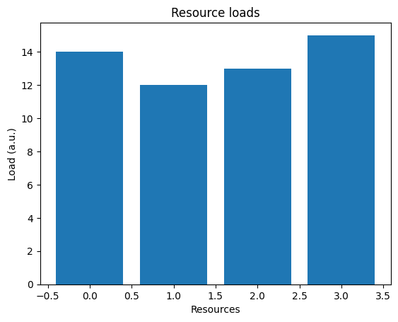  | 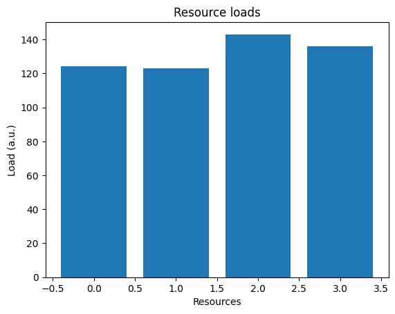  |
|           16           | 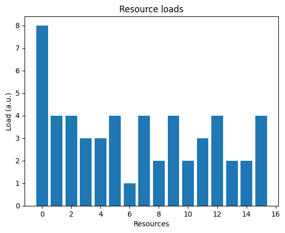 | 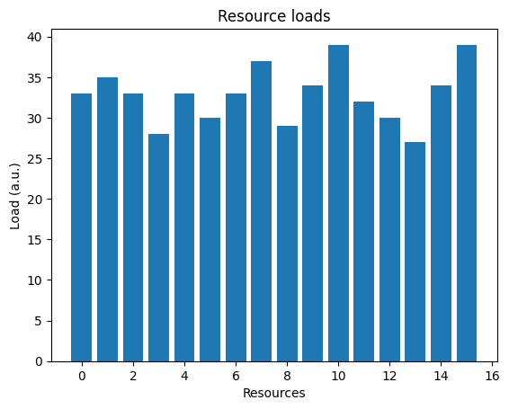 |

Avec l'algo `list_scheduler` la répartition des tâches est vraiment bonne quant il y à beaucoup de tâches, moyenne avec peu de tâches et peu de resources et moyenne bof quant il y a peu de tâches et beaucoup de resources.

| resources $\downarrow$ |                    20  tâches                     |                     200 tâches                     |
| :--------------------: | :-----------------------------------------------: | :------------------------------------------------: |
|           4            |   | 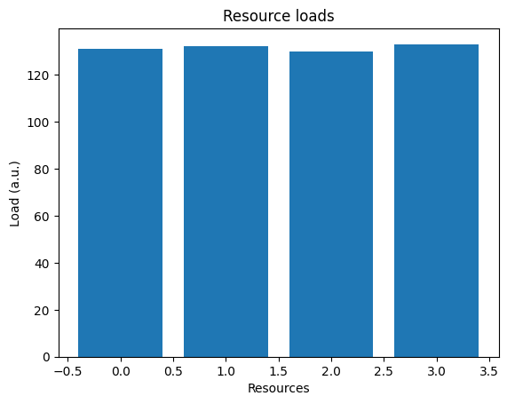  |
|           16           | 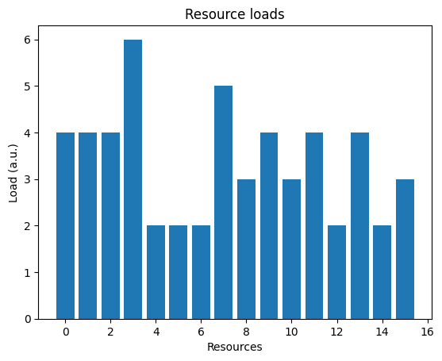 | 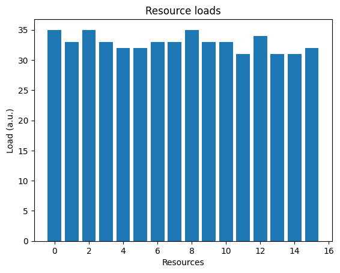 |

Avec l'algo `round_robin` la répartition des tâches est n'est pas bonne avec beaucoup de resources, moyenne avec beaucoup de tâches et peu de resources et moyenne bof quant il y a peu de tâches et peu de resources.

| resources $\downarrow$ |                   20  tâches                    |                    200 tâches                    |
| :--------------------: | :---------------------------------------------: | :----------------------------------------------: |
|           4            | 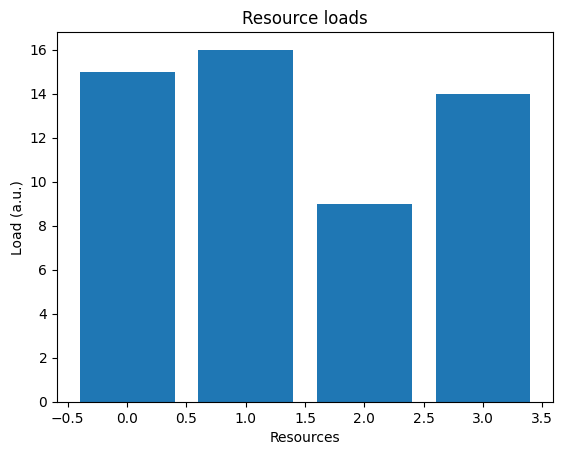  | 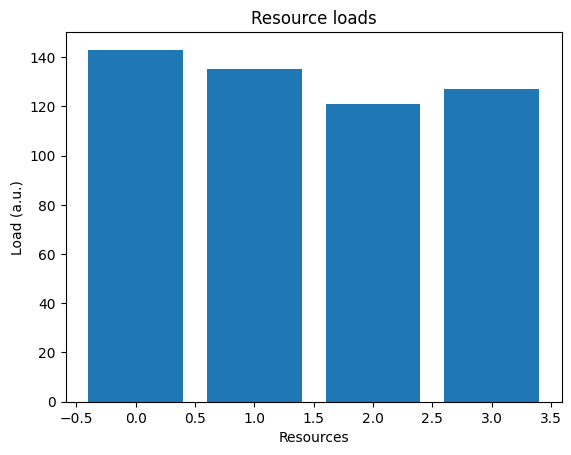  |
|           16           | 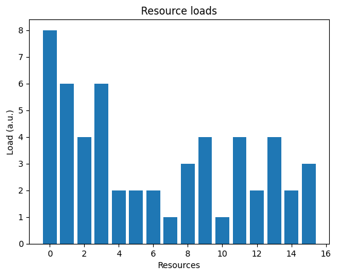 |  |

Avec l'algo `uniformly_random` la répartition des tâches est n'est pas bonne avec beaucoup de resources, pareil avec peu de tâches et peu de resources et moyenne bof quand il y à beaucoup de tâches et peu de resources.

| resources $\downarrow$ |                       20  tâches                       |                       200 tâches                        |
| :--------------------: | :----------------------------------------------------: | :-----------------------------------------------------: |
|           4            | 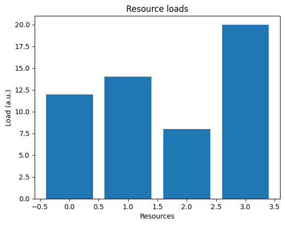  | 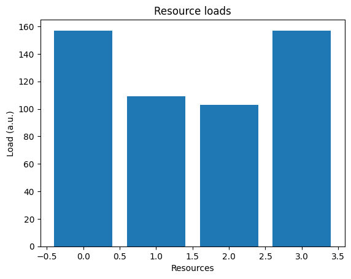  |
|           16           | 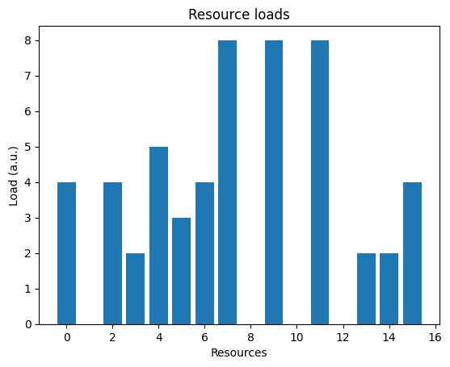 | 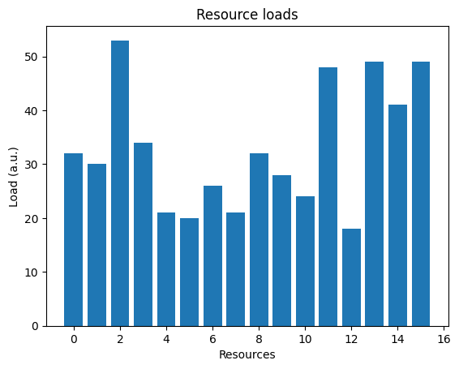 |

## 2

J'ai trouvé un cas compliqué (adversary case) pour le `list\_scheduler`. Ce cas est avec `8` tâches, `2` resources. Les tâche on les charges suivante : `[4, 3, 3, 2, 4, 1, 3, 4]`. L'algo `list\_scheduler` reparti `14` charge sur la premiére resource et `10` sur la seconde. Il existe une mayeur configuration avec `12` charge sur chaque resources.

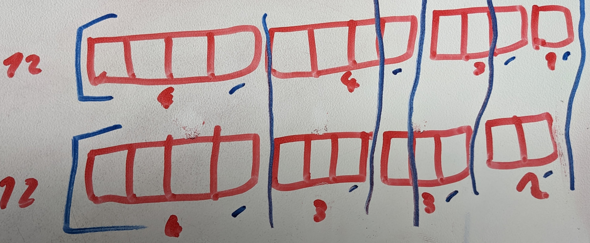

## 3

J'ai complété la fonction `lpt` et elle passe le test unitaire.

Le `lpt` résous bien le cas compliqué que le `list\_scheduler` résous pas bien.

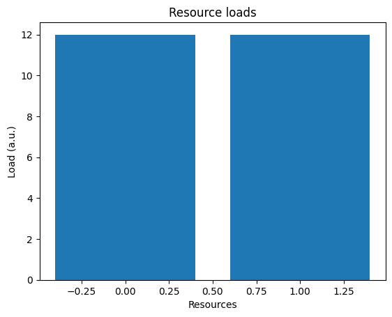

## 4

Les algos `list_scheduler` et `lpt` sont assé similaire on le constate avec quand on a beaucoup de tâches par-contre l'algo `lpt` fonctionne mieux quant il y as peut de tâches et beaucoup de resources.

|                   `lpt`                    |                   `list_scheduler`                    |
| :----------------------------------------: | :---------------------------------------------------: |
|  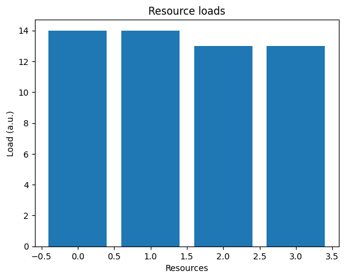  |    |
| 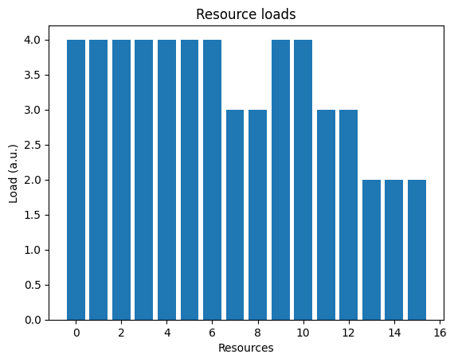  |   |
| 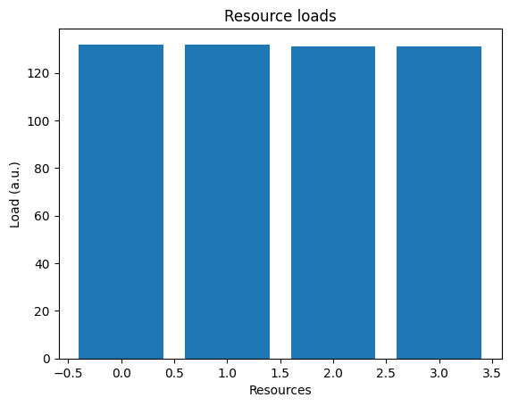  |   |
| 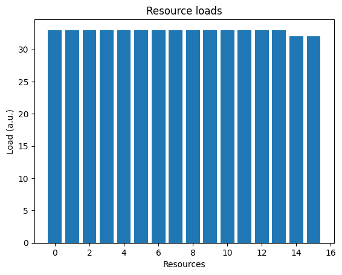 |  |

## 5

J'ai complété la fonction `lpt_with_limits` et elle passe le test unitaire.

## 6

Je n'ai pas trouvé de différence °~°.

|                   `lpt`                    |                   `list_scheduler`                    |
| :----------------------------------------: | :---------------------------------------------------: |
|    |    |
|   |   |
|   |   |
|  |  |

## 7

Je n'ai pas trouvé de cas compliqué (adversary case) °~°.

## 8

J'ai implémenté l'algo `list_scheduler_for_uniform_resources` mais mon implémentation ne passe las les tests.
