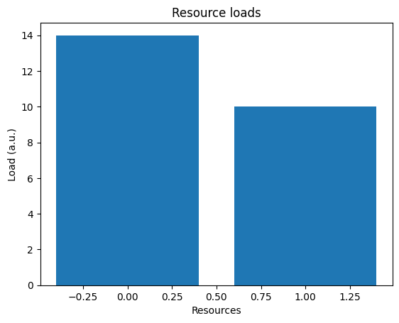

# TP load balancing

## 0

Ce que je comprends des résultats de `python3 complete_example.py` :

- On voit tous les paramètres (nombre de tâches, nombre de ressources, les tâches avec leur charge).
- On voit le mapping trouvé et la répartition par ressource.
- On voit la charge par ressource (la somme des charges de chaque tâches assignées).
- On voit aussi les _metrics_ qui permettent d'évaluer les performances des algos.

## 1

Ma comparaison des performances :

Avec l'algo `Compact`, la répartition des tâches est plutôt moyenne pour les cas où il y a plutôt beaucoup de tâches et quand il y a peu de tâches et peu de ressources. On voit aussi que la répartition n'est pas bonne pour peu de tâches sur beaucoup de ressources.

| ressources ↓ |                  20  tâches                   |                   200 tâches                   |
| :----------: | :-------------------------------------------: | :--------------------------------------------: |
|      4       |   |   |
|      16      |  |  |

Avec l'algo `List_scheduler`, la répartition des tâches est vraiment bonne quand il y a beaucoup de tâches, moyenne avec peu de tâches et peu de ressources et assez inégale quand il y a peu de tâches et beaucoup de ressources.

| ressources ↓ |                      20  tâches                      |                      200 tâches                       |
| :----------: | :--------------------------------------------------: | :---------------------------------------------------: |
|      4       |   |   |
|      16      |  |  |

Avec l'algo `Round_robin`, la répartition des tâches n'est pas bonne avec beaucoup de ressources, moyenne avec beaucoup de tâches et peu de ressources et légèrement inégale quand il y a peu de tâches et peu de ressources.

| ressources ↓ |                    20  tâches                     |                     200 tâches                     |
| :----------: | :-----------------------------------------------: | :------------------------------------------------: |
|      4       |   |   |
|      16      |  |  |

Avec l'algo `Uniformly_random` la répartition des tâches n'est pas bonne avec beaucoup de ressources, pareil avec peu de tâches et peu de ressources et assez inégale quand il y a beaucoup de tâches et peu de ressources.

| ressources ↓ |                       20  tâches                       |                       200 tâches                        |
| :----------: | :----------------------------------------------------: | :-----------------------------------------------------: |
|      4       |   |   |
|      16      |  |  |

## 2

J'ai trouvé un cas compliqué (adversary case) pour le `list\_scheduler`. Ce cas est avec `8` tâches, `2` ressources. Les tâches ont les charges suivantes : `[4, 3, 3, 2, 4, 1, 3, 4]`. L'algo `list\_scheduler` répartit `14` charges sur la première ressource et `10` sur la seconde. Il existe une meilleure configuration avec `12` charges sur chaque ressources.




## 3

J'ai complété la fonction `lpt` et elle passe le test unitaire.

Le code de mon algo :

```py
    # Empty mapping
    num_tasks = len(task_loads)
    mapping = [None] * num_tasks

    # sort tasks
    sorted_tasks = dict(enumerate(task_loads))
    sorted_tasks = dict(sorted(sorted_tasks.items(), key=lambda v: v[1], reverse=True))

    # distribute tasks
    resources = {k: 0 for k in range(num_resources)}

    for task, load in sorted_tasks.items():
      # get best resource
      resource = min(resources.items(), key=lambda x: x[1])[0]

      # map a task
      mapping[task] = resource
      resources[resource] += load
      if verbose:
          print(f'- Mapping task {task} to resource {resource}')

    return mapping
```

Le `lpt` résout bien le cas compliqué que le `list\_scheduler` ne résout pas bien.


## 4

Les algos `list_scheduler` et `lpt` sont assez similaires. On le constate quand on a beaucoup de tâches, par-contre l'algo `lpt` fonctionne mieux quand il y a peut de tâches et beaucoup de ressources.

|                   `lpt`                    |                   `list_scheduler`                    |
| :----------------------------------------: | :---------------------------------------------------: |
|    |    |
|   |   |
|   |   |
|  |  |

## 5

J'ai complété la fonction `lpt_with_limits` et elle passe le test unitaire.

Le code de mon algo :

```py
    # Empty mapping
    num_tasks = len(task_loads)
    mapping = [None] * num_tasks

    # sort tasks
    sorted_tasks = dict(enumerate(task_loads))
    sorted_tasks = dict(sorted(sorted_tasks.items(), key=lambda v: v[1], reverse=True))

    # distribute tasks
    resources = {k: [0, 0] for k in range(num_resources)}

    for task, load in sorted_tasks.items():
      # get best resource
      validRes = dict(filter(lambda x: x[1][1] < task_limit, resources.items()))

      if len(validRes.items()) != 0:
        resource = min(validRes.items(), key=lambda x: x[1])[0]
      else: # fallback when all resources exceed the task_limit
        resource = min(resources.items(), key=lambda x: x[1])[0]

      # map a task
      mapping[task] = resource
      resources[resource][0] += load
      resources[resource][1] += 1
      if verbose:
          print(f'- Mapping task {task} to resource {resource}')

    return mapping
```

## 6

Je n'ai pas trouvé de différence.

|                   `lpt`                    |                    `list_scheduler`                    |
| :----------------------------------------: | :----------------------------------------------------: |
|    |    |
|   |   |
|   |   |
|  |  |

## 7

Je n'ai pas trouvé de cas compliqué (adversary case).

Extrais du fichier [complete_example.py](study-load-balancing/complete_example.py) :

```py
def exp6(num_tasks = 20, num_resources = 4, makespan = 0):
    task_loads = support.generate_uniform_loads(num_tasks, 1, 5, 99)

    print("\nScenario 6: lpt_with_limits")
    mapping = schedulers.lpt_with_limits(task_loads, num_resources, makespan)
    support.evaluate_mapping(mapping, task_loads, num_resources)
    support.plot_mapping(mapping, task_loads, num_resources, 'scenario_lpt_with_limits_T' + str(num_tasks) + '_R' + str(num_resources) + '.png')

for i in range(8, 0, -1):
    print("makespan : " + str(i))
    exp4(20, 4)
    exp6(20, 4, i)
    exp4(20, 16)
    exp6(20, 16, i)

for i in range(60, 0, -1):
    exp4(200, 4)
    exp6(200, 4, i)
    exp4(200, 16)
    exp6(200, 16, i)
```

## 8

J'ai implémenté l'algo `list_scheduler_for_uniform_resources`, mon implémentation passe les tests. Ma solution trie les ressources par rapport à leur vitesse pour les premières tâches affectées puis, sélectionne la ressource qui a la plus petite valeur quand on divise ça charge avec la vitesse.

Le code de mon algo :

```py
    num_tasks = len(task_loads)
    mapping = [None] * num_tasks

    resource_heap = [(2 / resource_speeds[resource], resource) for resource in range(num_resources)]
    heapq.heapify(resource_heap)


    for task in range(num_tasks):
        resource_load, resource = heapq.heappop(resource_heap)

        mapping[task] = resource
        if verbose:
            print(f'- Mapping task {task} to resource {resource}')
        load = task_loads[task]
        heapq.heappush(resource_heap, (resource_load + (load / int(resource_speeds[resource])), resource))

    return mapping
```

J'ai choisi un scénario avec `200` tâches sur `4` ressources. Pour les vitesses, j'ai choisi d'avoir `2` ressources rapides et `2` ressources lentes, les ressources rapides vont deux fois plus vite (`[8, 8, 4, 4]`).

J'obtiens la répartition des charges suivante : `[178, 175, 86, 87]` avec les `2` premiers qui correspondent aux ressources rapides et les `2` suivantes aux ressources lentes. On peut voir que les ressources rapides sont bien deux fois plus rapide que les lentes.


