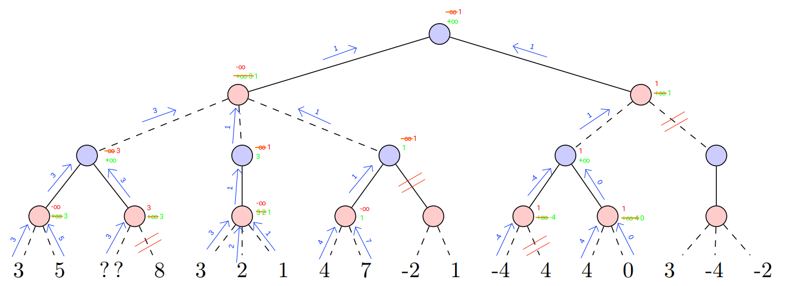
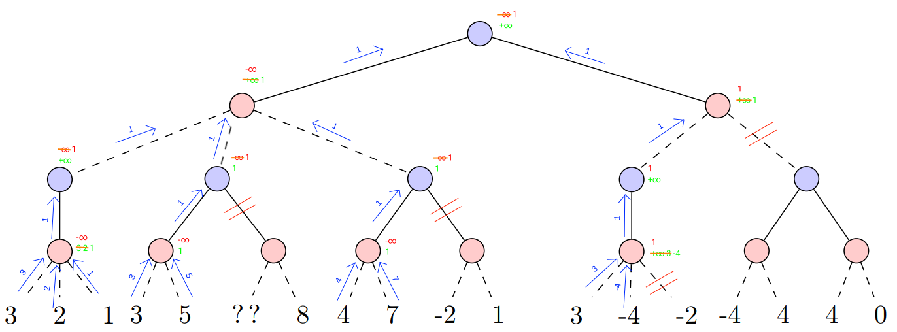

# TD 02

J'ai fait le td avec jupyter notebook. Vous pouvez regarder seulement le fichier `td-chess.ipynb` ou ce pdf et le fichier `main-chess.py`.

## Partie 1

Facture de branchement c'est le nombre max d'enfant.

On a nos plateau au niveau de feuille de la partie (des plateaux final)

1. Le facteur de branchement du jeu représenté sur l’arbre ci-dessus est de `3`. Non toutes les branches d’un arbre de jeu ne doivent pas être de la même hauteur, car des parties peuvent se finir plus vite que d'autres.

2. Le meilleur plateau pour Ami est le `8` et le meilleur pour Ennemi, c'est le `-4`. Un nœud de l'arbre peut avoir qu'un seul fils, car il y as qu'un seul coup possible (par exemple quand le roi est en échec). C'est une mauvaise chose pour amis, car il ne peut pas choisir son coup.

3. La plus grande valeur possible de la feuille "??" qui permet d'élaguer est `3`.

4.

5.

## Partie 2

1. En moins de 30 seconds on peut aller a une profondeur de `4`. On s'arrête a la 5ème.

| Profondeur :       | 1  |  2  |  3   |   4    |
|:------------------:|:--:|:---:|:----:|:------:|
| Nombre de noeuds : | 21 | 421 | 9323 | 206604 |

2. Codé

3. Codé

4. Matches fait

## Partie 3

1. J'ai codé l'`Iterative Deepening` (`alphaBetaID()`) avant de faire la comparaison.
Avec une partie partie sans aucun coup jouer :

MiniMax :
| Depth | Nb nodes | Move | Time |
|:-----:|:--------:|:----:|:----:|
| 0     | 21 | b1a3 | 0.00|
| 1     | 421 | d2d4 | 0.08|
| 2     | 9323 | c2c4 | 1.02|
| 3     | 206604 | h2h4 | 24.07|

Alpha-beta :
| Depth | Nb nodes | Move | Time |
|:-----:|:--------:|:----:|:----:|
| 0     | 23 | h2h4 | 0.01 |
| 1     | 99 | f3g1 | 0.02 |
| 2     | 1500 | g2g3 | 0.22 |
| 3     | 4736 | h1g1 | 0.42 |

Avec une partie partie avec des coups jouer

MiniMax :
| Depth | Nb nodes | Move | Time |
|:-----:|:--------:|:----:|:----:|
| 0     | 45 | f2f3 | 0.01 |
| 1     | 1134 | b2b3 | 0.12 |
| 2     | 44167 | c1e3 | 4.75 |

Alpha-beta :
| Depth | Nb nodes | Move | Time |
|:-----:|:--------:|:----:|:----:|
| 0     | 25 | a7a5 | 0.01 |
| 1     | 126 | e7e5 | 0.01 |
| 2     | 1756 | a7a6 | 0.18 |
| 3     | 22940 | g7g5 | 2.18 |

On voit que pour uns profondeur de `0` et `1` il y a peu de différence de nœuds explorés.
Par contre pour une profondeur plus grand, on voit que `alpha-beta` parcoure beaucoup moins de nœuds.
Et `alpha-beta` et nettement plus rapide.
Sur une partie déjà commencée, on peut voir que `alpha-beta` est bien plus efficace que `miniMax`.

2. Test de `alphaBetaID` (`Iterative Deepening`) qui garantir que la recherche ne dépassera jamais 10s de calcul :

| Depth | Nb nodes | Move | Time |
|:-----:|:--------:|:----:|:----:|
| 0     | 21 | a2a4 | 0.01 |
| 1     | 195 | g2g4 | 0.02 |
| 2     | 1322 | b2b3 | 0.21 |
| 3     | 6799 | d2d3 | 1.00 |
| 4     | 44812 | a2a4 | 4.35 |

1. Codé
