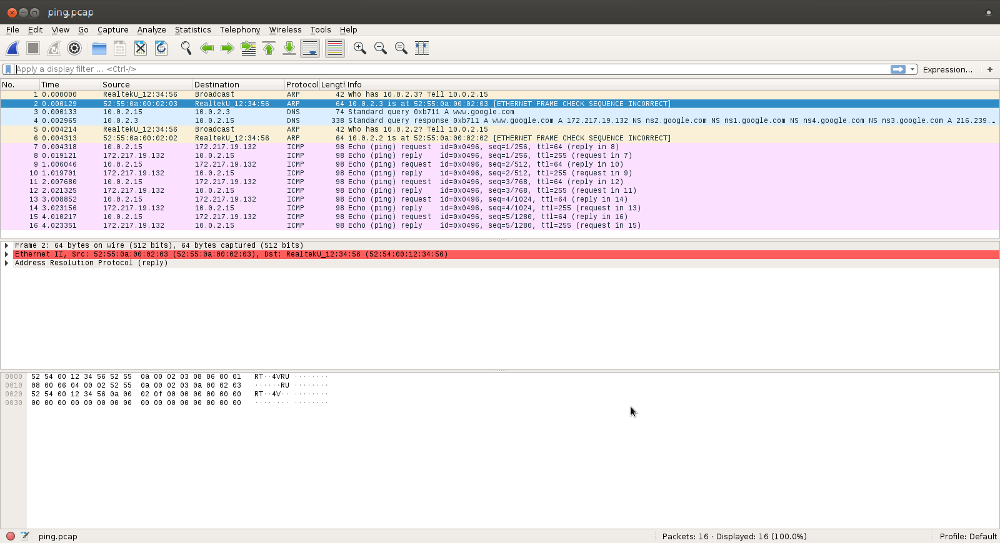
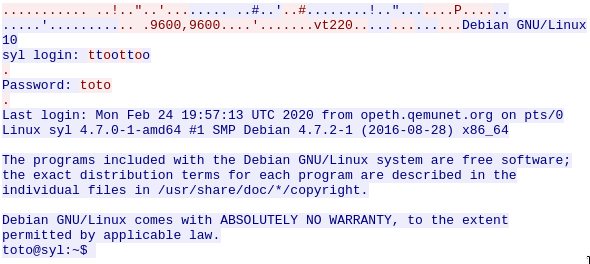
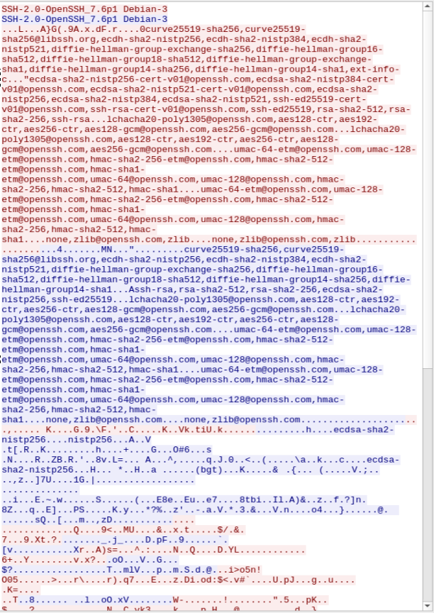

# TP 02

## Protocole ARP

- Lorsque je tape la commande `arp -n` j'obtiens bien l'adresse MAC du routeur :

```bash
Address          HWtype  HWaddress           Flags Mask      Iface
10.0.206.254     ether   58:20:b1:b1:23:00   C               eth0
```

- Lorsque j'effectue un ping vers la machine de mon voisin, je constate bien que son adresse MAC est dans ma table ARP :

```bash
Address          HWtype  HWaddress           Flags Mask      Iface
10.0.206.6       ether   d8:9e:f3:10:4a:1c   C               eth0
10.0.206.254     ether   58:20:b1:b1:23:00   C               eth0
```

- Je constate bien que la commande `ip neigh ls` affiche la même chose que la commande `arp -n` et affiche en plus les adresses ipv6 :

```bash
10.0.206.6 dev eth0 lladdr d8:9e:f3:10:4a:1c STALE
10.0.206.254 dev eth0 lladdr 58:20:b1:b1:23:00 REACHABLE
2001:660:6101:800:206::ffff dev eth0 lladdr 58:20:b1:b1:23:00 router STALE
fe80::5a20:b1ff:feb1:2300 dev eth0 lladdr 58:20:b1:b1:23:00 router STALE
```

- Leurs adresses MAC n'apparaissent pas dans la table ARP car ces 2 adresses ne sont pas dans mon réseau local.

## 2 Résolution de noms (DNS)

- Il y a plusieurs adresses IP dans le fichier `/etc/resolv.conf` car il y a un serveur DNS de secours au cas ou le premier ne fonctionne plus.

- ✓

- Il y a plusieurs adresses IP car il y a plusieurs serveurs. Le résultat est différent car ça dépend de quel serveur répond en premier.

```bash
yahoo.com has address 72.30.35.10
yahoo.com has address 98.137.246.7
yahoo.com has address 98.137.246.8
yahoo.com has address 98.138.219.231
yahoo.com has address 98.138.219.232
yahoo.com has address 72.30.35.9
yahoo.com has IPv6 address 2001:4998:58:1836::11
yahoo.com has IPv6 address 2001:4998:c:1023::4
yahoo.com has IPv6 address 2001:4998:c:1023::5
yahoo.com has IPv6 address 2001:4998:44:41d::3
yahoo.com has IPv6 address 2001:4998:44:41d::4
yahoo.com has IPv6 address 2001:4998:58:1836::10
```

- ✓

## 3 Services au CREMI : LDAP & NFS

- Il y a plusieurs serveurs pour s'adapter au nombre d'utilisateurs et également en cas de problèmes il y a des serveurs de secours. Le numéro de port est le 389 (636 pour ldpa en SSL). J'obtiens ces ports avec la commande `cat /etc/services | grep ldap` :

```bash
ldap    389/tcp    # Lightweight Directory Access Protocol
ldap    389/udp
ldaps   636/tcp    # LDAP over SSL
ldaps   636/udp
```

- Le résultat de la commande `df ~` est :

```bash
Filesystem          1K-blocks   Used Available Use% Mounted on
unityaccount:/account 4194304 773632   3420672  19% /autofs/unityaccount
/cremi
```

`cat /etc/services | grep nfs` :

```bash
nfs             2049/tcp                        # Network File System
nfs             2049/udp                        # Network File System
```

## 4 Analyse de Trames avec Wireshark

### 4.1 Préambule

- Les informations de la machine utilisée sont :
  - adresse ipv4 : `10.0.2.25`
  - masque du réseau : `255.255.255.0`
  - adresse de la passerelle : `10.0.2.2`
  - adresse du serveur DNS : `10.0.2.3`

### 4.2 Prise en main de Wireshark

- J'ai ouvert le fichier ping.pcap et j'ai regardé les différentes trames :


### 4.3 Ping

- L'adresse Ethernet à qui est destinée la requête ARP dans la trame 1 est `FF FF FF FF FF FF`. On doit utiliser un broadcast pour connaître l'adresse MAC de la machine qui à l'adresse IP : `10.0.2.15`. La machine qui à l'adresse IP répondra avec son adresse MAC.
- Le protocole de transport utilisé pour les trames 3 et 4 est UDP. L'adresse IP de la machine www.google.com retournée par le serveur DNS est : `172.271.19.132`.
- On cherche à trouver l'adresse Ethernet (MAC) de la machine 10.0.2.2 au lieu de l'adresse de la machine cible www.google.com car cette machine n'est pas dans le même réseau donc on cherche à avoir l'adresse MAC de la passerelle (10.0.2.2).
- J'observe que la valeur du champs type dans l'en-tête ICMP change pour la trame 7 c'est `8` pour `Echo (ping) request` et pour la trame 8 c'est `0` pour `Echo (ping) reply`.

### 4.4 Une page Web : je suis perdu *!*

- Le port source de la trame 7 est `37090`. le port destination est `80`. Le flag SYN veut dire "syncronise". Ce flag permet d'initialliser une connexion TCP (synchrone).
- Les trames de la conversation TCP qui correspondent à la requête HTTP et à la réponse HTTP sont : la trame `10` pour la requête et la trame `12` pour la réponse.
- Le rôle des champs est :
  - User-Agent : Est égal au navigateur internet qui est utilisé.
  - Host : C'est le nom de domaine ou l'adresse IP du serveur web.
  - Connection : Indique si la connexion doit se fermer ou pas à la fin du chargement de la page.
- Oui elle est là.
- Dans la réponse HTTP on peut déduire :
  - le logiciel serveur web est `Apache`
  - la longeur du contenu dans la réponse est `204`
  - le type du contenu est `text/html`
- Oui je vois le code HTML de la page.
- Quant on fait "clic droit" sur un des paquets TCP puis "Follow" on voit la requête est la réponse HTTP :

```HTTP
GET / HTTP/1.1
User-Agent: Wget/1.20.1 (linux-gnu)
Accept: */*
Accept-Encoding: identity
Host: perdu.com
Connection: Close

HTTP/1.1 200 OK
Date: Wed, 19 Feb 2020 18:44:39 GMT
Server: Apache
Upgrade: h2
Connection: Upgrade, close
Last-Modified: Thu, 02 Jun 2016 06:01:08 GMT
ETag: "cc-5344555136fe9"
Accept-Ranges: bytes
Content-Length: 204
Vary: Accept-Encoding
Content-Type: text/html

<html><head><title>Vous Etes Perdu ?</title></head><body><h1>Perdu sur l
'Internet ?</h1><h2>Pas de panique, on va vous aider</h2><strong><pre>
* <----- vous &ecirc;tes ici</pre></strong></body></html>
```

## 5 Capture de Trames avec Wireshark

- Résultat de la commande `nmap syl` :

```bash
PORT   STATE SERVICE
  21/tcp open  ftp
  22/tcp open  ssh
  23/tcp open  telnet
  80/tcp open  http
  ```

- ✓.
- ✓.
- je teste tous les ports avec la commande `nc` :
  - `nc syl 21` donne :

  ```bash
  220 syl.qemunet.org FTP server (Version 6.4/OpenBSD/Linux-ftpd-0.17
  ) ready.
  ```

  - `nc syl 22` donne :

  ```bash
  SSH-2.0-OpenSSH_7.6p1 Debian-3
  ```

  - `nc syl 23` donne :

  ```md
  ÿýÿý ÿý#ÿý'
  ```

  - `nc syl 80` donne :

  ```http
  HTTP/1.1 400 Bad Request
  Date: Mon, 24 Feb 2020 19:45:53 GMT
  Server: Apache/2.4.38 (Debian)
  Content-Length: 307
  Connection: close
  Content-Type: text/html; charset=iso-8859-1

  <!DOCTYPE HTML PUBLIC "-//IETF//DTD HTML 2.0//EN">
  <html><head>
  <title>400 Bad Request</title>
  </head><body>
  <h1>Bad Request</h1>
  <p>Your browser sent a request that this server could not understan
  d.<br />
  </p>
  <hr>
  <address>Apache/2.4.38 (Debian) Server at syl.qemunet.org Port 80</
  address>
  </body></html>
  ```

- Lorsque je me connecte avec l'utilisateur toto en utilisant la commande `telnet syl` je peux lire le mot de passe dans les requêtes en utilisant Follow TCP stream :
  
- Quant je fais la même chose avec la commande `ssh toto@syl` je ne vois pas le mot de passe car il est crypté :
  
- J'utilise la commande `curl http://syl`. Cette commande permet d'obtenir le contenu de la page web comme avec google par exemple. Il s'agie de la page web par défaut du serveur Web `Apache 2.0` comme vous pouvez le voir ci-dessous :

```html
<!DOCTYPE html PUBLIC "-//W3C//DTD XHTML 1.0 Transitional//EN" "http://w
ww.w3.org/TR/xhtml1/DTD/xhtml1-transitional.dtd">
<html xmlns="http://www.w3.org/1999/xhtml">
  <head>
    <meta http-equiv="Content-Type" content="text/html; charset=UTF-8" />
    <title>Apache2 Debian Default Page: It works</title>
    <style type="text/css" media="screen">
    * {
      margin: 0px 0px 0px 0px;
      padding: 0px 0px 0px 0px;
    }

    body, html {
      padding: 3px 3px 3px 3px;

      background-color: #D8DBE2;

      font-family: Verdana, sans-serif;
      font-size: 11pt;
      text-align: center;
    }
    [...]
        </div>
    </div>
    <div class="validator">
    </div>
  </body>
</html>
```

Je vois l'en-tête dans Wireshark.
