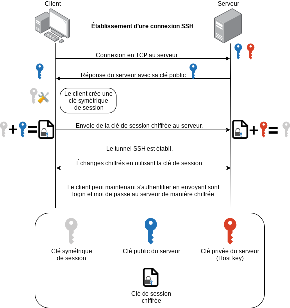
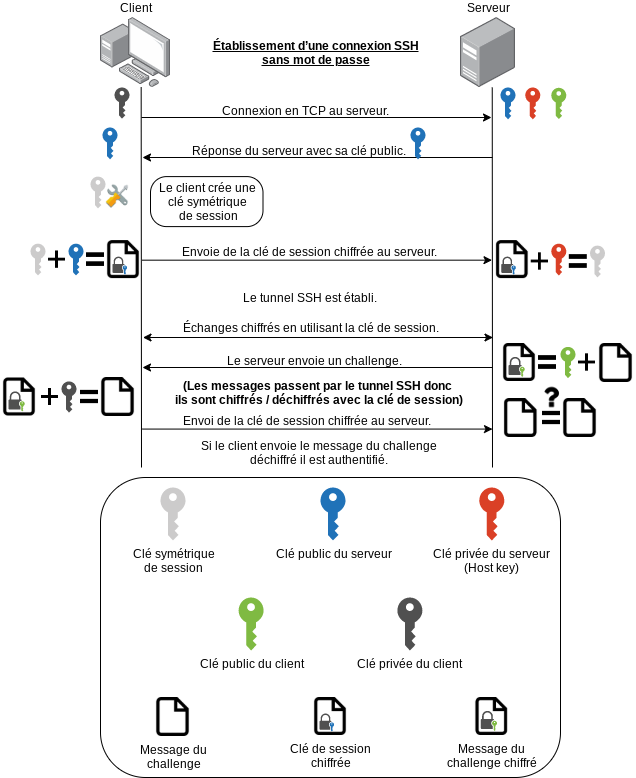

# TP7

## 1 Introduction et premiers pas avec SSH

### 1.1 Rappels de quelques notions sur le chiffrement

### 1.2 Le protocole SSH

- Schéma de l'établissement d'une connexion SSH :


&nbsp;

&nbsp;

&nbsp;

&nbsp;

&nbsp;

- SSH garanti la sécurité de la communication car :
  - La confidentialité est garantie du fait que les communications sont chiffrées.
  - L'authentification est respectée, dans les deux sens, car seul le serveur et le client connaisse la clé de session ce qui fait que personne d'autre ne peut se faire passer pour l'un ou l'autre.
  - L'intégrité des données échangées et garantie car seul le serveur et le client peuvent chiffrés et déchiffrés les messages avec la clé de session. Mais aussi car personne ne peut modifier les messages lors de leur envoient et il ne peut pas y avoir de perte de paquet car la connexion est en TCP.

- Lorsqu'on se connecte pour la première fois à un serveur donné le client ssh nous demande si la clé publique récupérée est bien celle du serveur car un autre serveur pourrait répondre à la place du serveur à qui l'on a envoyé la requête de connexion. C'est pour cela que l'on nous demande si la clé publique est bien la bonne la première fois. Pour les fois suivante la clé publique est enregistrée dans le fichier `known_hosts`. Ensuite à chaque connexion la clé publique est comparée automatiquement (pour vérifier l'authenticité du serveur).
La clé privée du serveur doit rester secrète car c'est la seule à pouvoir déchiffrer les messages chiffrés par la clé publique.
- Le serveur écoute sur le port `22` par défaut.

## 2 Assez des mots de passe ?

### 2.1 On oublie les mots de passe

- C'est fait ✓
- Effectivement ✓
- C'est fait ✓

  ```txt
  Generating public/private rsa key pair.
  Enter file in which to save the key (/net/cremi/cgoedefroit/.ssh/id_rsa):
  Enter passphrase (empty for no passphrase):
  Enter same passphrase again:
  Your identification has been saved in id_rsa.
  Your public key has been saved in id_rsa.pub.
  The key fingerprint is:
  SHA256:o+d00vzeP8/IpyGyX8/3NWfyiEo1X6qQSg+Cyut+UA4 cgoedefroit@leger
  The key's randomart image is:
  +---[RSA 2048]----+
  |                 |
  |                 |
  |                 |
  |  E .            |
  |   +    S   o   .|
  |  . .. . + o o o |
  |   .. o * O . *.+|
  | . ..  * B = B %*|
  | o*o    o ++* *+&|
  +----[SHA256]-----+
  ```

- C'est fait ✓
- Effectivement ✓

- Schéma de l'établissement d'une connexion SSH sans mot de passe :

- C'est fait avec la commande `chmod 711 ~` :

  ```txt
  cgoedefroit@leger:/net/cremi/$ ls -la | grep cgoedefroit
  drwx--x--x   29 cgoedefroit       grp30001   8192 May  7 23:41 cgoedefroit
  ```

- C'est fait avec la commande `chmod 711 .ssh`

  ```txt
  cgoedefroit@leger:~$ ls -la | grep .ssh
  drwx--x--x    2 cgoedefroit grp30001   8192 May  7 00:45 .ssh
  ```

- J'ai modifié les droits du fichier `~/.ssh/id_rsa` avec la commande `chmod 644 ~/.ssh/id_rsa`. Lorsque je tente de me connecter sur un serveur distant, qui a ma clé publique, le client ssh ne fait pas le challenge et me demande le mot de passe car ma clé privée n'est plus vraiment privé car tout le monde a la permission en lecture sur le fichier :

  ```txt
  cgoedefroit@leger:~$ ssh -Y trelawney
  @@@@@@@@@@@@@@@@@@@@@@@@@@@@@@@@@@@@@@@@@@@@@@@@@@@@@@@@@@@
  @         WARNING: UNPROTECTED PRIVATE KEY FILE!          @
  @@@@@@@@@@@@@@@@@@@@@@@@@@@@@@@@@@@@@@@@@@@@@@@@@@@@@@@@@@@
  Permissions 0644 for '/net/cremi/cgoedefroit/.ssh/id_rsa' are too open.
  It is required that your private key files are NOT accessible by others.
  This private key will be ignored.
  Load key "/net/cremi/cgoedefroit/.ssh/id_rsa": bad permissions
  cgoedefroit@trelawney's password:
  ```

  ```txt
  -rw-r--r--  1 cgoedefroit grp30001  1679 May  7 00:39 id_rsa
  ```

- C'est fait avec la commande `chmod 600 ~/.ssh/id_rsa`. J'ai modifié les droits du fichier `~/.ssh/authorized_keys` avec la commande `chmod 666 ~/.ssh/authorized_keys`. Lorsque je tente de me connecter au serveur distant, celui-ci ne m'envoie pas de challenge car tout le monde peut modifier le fichier `~/.ssh/authorized_keys` et potentiellement ajouté sa propre clé publique.

  ```txt
  cgoedefroit@leger:~$ ssh -Y trelawney
  cgoedefroit@trelawney's password:
  ```

  J'ai rétabli les droits d'origine du fichier avec la commande `chmod 644 ~/.ssh/authorized_keys`.
- Il compare la clé publique dans le fichier authorized_keys avec la clé publique que je lui donne.

La manière la plus sûre de procéder est de lui créer un utilisateur, qu'il fournisse sa clé publique (par mail, clé USB...) qu'il faut mettre dans son fichier `~/.ssh/authorized_keys` et lui donner la clé publique du serveur en plus de son identifiant et du nom d'hôte. Le fait de lui donner la clé publique du serveur lui permettra de comparer avec celle que le serveur lui enverra.

&nbsp;

&nbsp;

&nbsp;

### 2.2 Mode paranoïaque

On a quand même amélioré la sécurité car avec une passphrase seul le challenge passe par le réseau contrairement à un mot de passe qui passe par le réseau. Utiliser une passphrase sur un ordinateur et surtout un ordinateur portable renforce la sécurité car en cas de vole ou de piratage la clé privée n'est pas utilisable telle quelle.

- C'est fait tous les processus (ssh-agent) ont reçu là demande de suicide :wink: avec la commande `killall ssh-agent`.

- C'est fait ✓
  Les nouvelles variables d'environnement sont :

  ```txt
  SSH_AUTH_SOCK=/tmp/ssh-AtzI1eOQzZBc/agent.66204
  SSH_AGENT_PID=66205
  ```

- C'est fait ✓
- Je n'ai pas eu à mettre ma passphrase.
- Il n'arrive pas à profiter de l'agent car l'agent n'est pas allumé.
- Non car il faut rallumer l'agent à chaque fois. Pour éviter ceci on utilise l'option `-A` qui permet de transférer l'agent.

## 3 Gestion de certificats x509

### 3.1 Autorité de certification

- Création de la clé privée de notre autorité :

  ```txt
  Generating a 3072 bit RSA private key...
  ```

- Création d'un certificat racine :

  ```txt
  Generating a self signed certificate...
  Please enter the details of the certificate's distinguished name. Just press enter to ignore a field.
  Common name: ma.CA.a.moi.fr
  UID:
  Organizational unit name:
  Organization name:
  Locality name:
  State or province name:
  Country name (2 chars):
  Enter the subject's domain component (DC):
  This field should not be used in new certificates.
  E-mail:
  Enter the certificate's serial number in decimal (default: 6824446147989322962):


  Activation/Expiration time.
  The certificate will expire in (days): 1000


  Extensions.
  Does the certificate belong to an authority? (y/N): y
  Path length constraint (decimal, -1 for no constraint):
  Is this a TLS web client certificate? (y/N):
  Will the certificate be used for IPsec IKE operations? (y/N):
  Is this a TLS web server certificate? (y/N):
  Enter a dnsName of the subject of the certificate:
  Enter a URI of the subject of the certificate:
  Enter the IP address of the subject of the certificate:
  Enter the e-mail of the subject of the certificate:
  Will the certificate be used to sign OCSP requests? (y/N):
  Will the certificate be used to sign code? (y/N):
  Will the certificate be used for time stamping? (y/N):
  Will the certificate be used for email protection? (y/N):
  Will the certificate be used to sign other certificates? (y/N): y
  Will the certificate be used to sign CRLs? (y/N):
  Enter the URI of the CRL distribution point:
  X.509 Certificate Information:
    Version: 3
    Serial Number (hex): 5eb54d9d37afbcd2
    Validity:
      Not Before: Fri May 08 12:16:33 UTC 2020
      Not After: Thu Feb 02 12:16:44 UTC 2023
    Subject: CN=ma.CA.a.moi.fr
    Subject Public Key Algorithm: RSA
    Algorithm Security Level: High (3072 bits)
      Modulus (bits 3072):
        00:e1:ba:5d:41:cc:2a:ca:8a:f3:d8:64:f7:d7:53:49
        e4:60:8c:d7:1b:e5:2d:19:31:65:92:fb:a3:57:8d:0d
        2a:2e:c5:92:6f:4c:e7:3c:69:30:d4:02:1d:3e:c6:9e
        f0:24:96:97:ae:52:fa:9d:52:ac:4f:bd:73:74:f4:b7
        70:9d:c9:2e:63:f6:2f:d5:de:4d:72:ee:d6:06:33:31
        93:47:89:34:76:b7:a5:6b:b0:2c:6b:66:c8:a6:2e:70
        cd:36:5d:69:bd:a9:e5:79:37:ae:20:88:ea:1a:46:e1
        db:1a:44:43:6d:3b:71:ae:50:97:a2:48:5e:90:b1:d6
        82:53:3c:b9:bc:be:40:4e:9d:8f:0b:09:60:e7:d3:12
        91:ff:ac:71:9e:23:37:b9:28:5c:58:1e:6f:ca:e8:5d
        76:bd:85:53:b5:e8:c2:e4:03:b9:1e:8e:c0:71:f3:dc
        1b:c1:cc:a5:2c:c6:be:a1:cb:48:d8:30:05:df:b9:e4
        4c:88:01:6c:5a:04:56:62:49:19:23:07:69:54:5d:73
        ce:bc:f3:69:86:0e:9b:bb:2a:35:57:ba:83:26:ab:c2
        81:c2:72:f1:6b:6b:d9:b0:06:7c:74:fb:c0:0e:e1:4f
        ed:db:84:36:28:75:95:55:5e:bb:62:6a:d1:d3:49:fa
        8a:09:79:8d:4c:3f:be:42:66:53:4f:c4:d8:e0:8e:a2
        e9:fa:ad:3a:6c:dc:f9:82:19:0a:c0:f6:6f:bc:70:ac
        7c:e7:a8:9d:5f:6b:16:06:d4:bc:b8:e7:2b:77:87:7b
        71:9d:b6:1d:8b:d5:fd:bb:44:bd:41:e3:76:2f:b5:af
        a0:70:31:2e:53:64:bf:cb:03:28:d2:f5:b7:2c:07:99
        2b:c4:fb:0c:1d:5d:c6:5f:14:86:a9:79:e5:c4:42:b5
        d6:8c:30:9b:02:52:f4:cd:0a:fd:c0:2f:23:d5:e5:9e
        e6:27:cc:b5:47:04:01:ff:bc:d1:ca:bc:b7:4a:9a:38
        85
      Exponent (bits 24):
        01:00:01
    Extensions:
      Basic Constraints (critical):
        Certificate Authority (CA): TRUE
      Key Usage (critical):
        Certificate signing.
      Subject Key Identifier (not critical):
        23ac225445604368ebc1734cfcc9e32c5f59069a
  Other Information:
    Public Key ID:
      sha1:23ac225445604368ebc1734cfcc9e32c5f59069a
      sha256:7176e019398d206b958bda2317301dc8eab40d6287fbd0acfc2a0e44b6164d2a
    Public Key PIN:
      pin-sha256:cXbgGTmNIGuVi9ojFzAdyOq0DWKH+9Cs/CoORLYWTSo=
    Public key's random art:
      +--[ RSA 3072]----+
      |  +=oo           |
      | o.oo  .         |
      |o +.o + .        |
      | =.o E   o       |
      |..+ o + S        |
      |.. . + + .       |
      |. . + .          |
      | . . .           |
      |                 |
      +-----------------+

  Is the above information ok? (y/N): y


  Signing certificate...
  ```

- Effectivement on peut revoir le contenu du certificat à l’aide de la commande `certtool --infile ca.crt --certificate-info` :

  ```txt
  X.509 Certificate Information:
    Version: 3
    Serial Number (hex): 5eb54d9d37afbcd2
    Issuer: CN=ma.CA.a.moi.fr
    Validity:
      Not Before: Fri May 08 12:16:33 UTC 2020
      Not After: Thu Feb 02 12:16:44 UTC 2023
    Subject: CN=ma.CA.a.moi.fr
    Subject Public Key Algorithm: RSA
    Algorithm Security Level: High (3072 bits)
      Modulus (bits 3072):
        00:e1:ba:5d:41:cc:2a:ca:8a:f3:d8:64:f7:d7:53:49
        e4:60:8c:d7:1b:e5:2d:19:31:65:92:fb:a3:57:8d:0d
        2a:2e:c5:92:6f:4c:e7:3c:69:30:d4:02:1d:3e:c6:9e
        f0:24:96:97:ae:52:fa:9d:52:ac:4f:bd:73:74:f4:b7
        70:9d:c9:2e:63:f6:2f:d5:de:4d:72:ee:d6:06:33:31
        93:47:89:34:76:b7:a5:6b:b0:2c:6b:66:c8:a6:2e:70
        cd:36:5d:69:bd:a9:e5:79:37:ae:20:88:ea:1a:46:e1
        db:1a:44:43:6d:3b:71:ae:50:97:a2:48:5e:90:b1:d6
        82:53:3c:b9:bc:be:40:4e:9d:8f:0b:09:60:e7:d3:12
        91:ff:ac:71:9e:23:37:b9:28:5c:58:1e:6f:ca:e8:5d
        76:bd:85:53:b5:e8:c2:e4:03:b9:1e:8e:c0:71:f3:dc
        1b:c1:cc:a5:2c:c6:be:a1:cb:48:d8:30:05:df:b9:e4
        4c:88:01:6c:5a:04:56:62:49:19:23:07:69:54:5d:73
        ce:bc:f3:69:86:0e:9b:bb:2a:35:57:ba:83:26:ab:c2
        81:c2:72:f1:6b:6b:d9:b0:06:7c:74:fb:c0:0e:e1:4f
        ed:db:84:36:28:75:95:55:5e:bb:62:6a:d1:d3:49:fa
        8a:09:79:8d:4c:3f:be:42:66:53:4f:c4:d8:e0:8e:a2
        e9:fa:ad:3a:6c:dc:f9:82:19:0a:c0:f6:6f:bc:70:ac
        7c:e7:a8:9d:5f:6b:16:06:d4:bc:b8:e7:2b:77:87:7b
        71:9d:b6:1d:8b:d5:fd:bb:44:bd:41:e3:76:2f:b5:af
        a0:70:31:2e:53:64:bf:cb:03:28:d2:f5:b7:2c:07:99
        2b:c4:fb:0c:1d:5d:c6:5f:14:86:a9:79:e5:c4:42:b5
        d6:8c:30:9b:02:52:f4:cd:0a:fd:c0:2f:23:d5:e5:9e
        e6:27:cc:b5:47:04:01:ff:bc:d1:ca:bc:b7:4a:9a:38
        85
      Exponent (bits 24):
        01:00:01
    Extensions:
      Basic Constraints (critical):
        Certificate Authority (CA): TRUE
      Key Usage (critical):
        Certificate signing.
      Subject Key Identifier (not critical):
        23ac225445604368ebc1734cfcc9e32c5f59069a
    Signature Algorithm: RSA-SHA256
    Signature:
      b0:6d:bd:7f:de:35:c1:bf:27:cf:11:35:bb:08:24:66
      3d:fe:42:1e:82:ea:95:4a:f7:42:70:5d:3e:b0:86:02
      c1:d7:f3:30:38:6e:57:8b:1c:32:1e:81:1d:92:0f:a0
      82:89:45:7c:c4:2c:70:8e:8c:10:bc:1f:f0:2a:03:67
      e5:81:c9:0c:13:df:57:98:e2:9c:89:0a:d0:08:51:0a
      de:0d:d5:4c:90:3f:41:94:4e:de:1a:b8:5f:12:fe:61
      a2:8b:e8:7f:2b:ee:b1:0f:8f:8e:e0:ec:4e:0e:ab:ed
      56:51:21:a8:01:c1:4f:bd:36:d6:9a:e1:a7:08:5a:ea
      39:51:40:d0:76:a5:5e:28:08:bb:44:d5:c0:e9:ea:d4
      c8:1b:b1:96:89:1d:fc:a4:fa:06:d1:3d:7e:d5:74:97
      46:2b:87:78:31:ca:37:40:9c:98:2b:b4:28:d6:97:f6
      b9:1b:19:e9:14:51:ba:47:dd:ed:da:de:4a:44:9d:dd
      90:9e:16:bc:34:b0:dd:2a:69:ab:22:f3:da:9e:03:be
      f3:e5:c2:43:d0:3e:01:3c:f4:57:2a:98:ec:70:8a:76
      51:30:14:0e:fa:d8:ba:8b:3d:4c:30:eb:7c:19:62:04
      d8:ca:61:ed:86:d2:76:8a:2e:45:d2:dd:40:b2:45:e8
      3e:40:5f:dd:bf:b5:13:0f:38:42:a1:3f:05:fe:36:c5
      8d:2f:bc:f0:e5:1e:49:e2:ab:0e:99:47:3e:07:8d:9e
      ec:ad:c4:27:fa:b5:e8:43:d4:49:a3:4c:2e:d7:38:1b
      3a:c5:c7:67:e9:98:73:14:6e:00:da:b1:09:d7:0a:f7
      6f:0c:00:ba:88:e7:64:cc:11:59:d9:d6:4e:5c:dc:4d
      ab:21:5e:f6:4a:32:0e:e1:65:b4:4d:a8:b7:61:82:bb
      cd:34:20:d8:43:d4:ef:b2:3d:85:23:e4:3e:0a:0e:67
      fb:d6:41:73:e9:91:e9:11:8d:e8:84:2e:ad:72:97:5d
  Other Information:
    Fingerprint:
      sha1:00611cdb888e5bd279dc767b487255f77df41e8a
      sha256:b26e0eda296b6da6b21b9c03f2dfe5d7d69a61970120ff7381ac080f550dfe76
    Public Key ID:
      sha1:23ac225445604368ebc1734cfcc9e32c5f59069a
      sha256:7176e019398d206b958bda2317301dc8eab40d6287fbd0acfc2a0e44b6164d2a
    Public Key PIN:
      pin-sha256:cXbgGTmNIGuVi9ojFzAdyOq0DWKH+9Cs/CoORLYWTSo=
    Public key's random art:
      +--[ RSA 3072]----+
      |  +=oo           |
      | o.oo  .         |
      |o +.o + .        |
      | =.o E   o       |
      |..+ o + S        |
      |.. . + + .       |
      |. . + .          |
      | . . .           |
      |                 |
      +-----------------+

  -----BEGIN CERTIFICATE-----
  MIID9zCCAl+gAwIBAgIIXrVNnTevvNIwDQYJKoZIhvcNAQELBQAwGTEXMBUGA1UE
  AxMObWEuQ0EuYS5tb2kuZnIwHhcNMjAwNTA4MTIxNjMzWhcNMjMwMjAyMTIxNjQ0
  WjAZMRcwFQYDVQQDEw5tYS5DQS5hLm1vaS5mcjCCAaIwDQYJKoZIhvcNAQEBBQAD
  ggGPADCCAYoCggGBAOG6XUHMKsqK89hk99dTSeRgjNcb5S0ZMWWS+6NXjQ0qLsWS
  b0znPGkw1AIdPsae8CSWl65S+p1SrE+9c3T0t3CdyS5j9i/V3k1y7tYGMzGTR4k0
  drela7Asa2bIpi5wzTZdab2p5Xk3riCI6hpG4dsaRENtO3GuUJeiSF6QsdaCUzy5
  vL5ATp2PCwlg59MSkf+scZ4jN7koXFgeb8roXXa9hVO16MLkA7kejsBx89wbwcyl
  LMa+octI2DAF37nkTIgBbFoEVmJJGSMHaVRdc86882mGDpu7KjVXuoMmq8KBwnLx
  a2vZsAZ8dPvADuFP7duENih1lVVeu2Jq0dNJ+ooJeY1MP75CZlNPxNjgjqLp+q06
  bNz5ghkKwPZvvHCsfOeonV9rFgbUvLjnK3eHe3Gdth2L1f27RL1B43Yvta+gcDEu
  U2S/ywMo0vW3LAeZK8T7DB1dxl8Uhql55cRCtdaMMJsCUvTNCv3ALyPV5Z7mJ8y1
  RwQB/7zRyry3Spo4hQIDAQABo0MwQTAPBgNVHRMBAf8EBTADAQH/MA8GA1UdDwEB
  /wQFAwMHBAAwHQYDVR0OBBYEFCOsIlRFYENo68FzTPzJ4yxfWQaaMA0GCSqGSIb3
  DQEBCwUAA4IBgQCwbb1/3jXBvyfPETW7CCRmPf5CHoLqlUr3QnBdPrCGAsHX8zA4
  bleLHDIegR2SD6CCiUV8xCxwjowQvB/wKgNn5YHJDBPfV5jinIkK0AhRCt4N1UyQ
  P0GUTt4auF8S/mGii+h/K+6xD4+O4OxODqvtVlEhqAHBT7021prhpwha6jlRQNB2
  pV4oCLtE1cDp6tTIG7GWiR38pPoG0T1+1XSXRiuHeDHKN0CcmCu0KNaX9rkbGekU
  UbpH3e3a3kpEnd2Qnha8NLDdKmmrIvPangO+8+XCQ9A+ATz0VyqY7HCKdlEwFA76
  2LqLPUww63wZYgTYymHthtJ2ii5F0t1AskXoPkBf3b+1Ew84QqE/Bf42xY0vvPDl
  Hkniqw6ZRz4HjZ7srcQn+rXoQ9RJo0wu1zgbOsXHZ+mYcxRuANqxCdcK928MALqI
  52TMEVnZ1k5c3E2rIV72SjIO4WW0Tai3YYK7zTQg2EPU77I9hSPkPgoOZ/vWQXPp
  kekRjeiELq1yl10=
  -----END CERTIFICATE-----
  ```

- Pareil pour le fingerprint avec la commande `certtool --infile ca.crt --fingerprint` :

  ```txt
  00611cdb888e5bd279dc767b487255f77df41e8a
  ```

### 3.2 Requête du serveur : demande d’un certificat

- Création de la clé privée de notre serveur :

  ```txt
  Generating a 3072 bit RSA private key...
  ```

- Création d'une requête pour le serveur :

  ```txt
  Generating a PKCS #10 certificate request...
  Common name: 127.0.0.1
  Organizational unit name:
  Organization name:
  Locality name:
  State or province name:
  Country name (2 chars):
  Enter the subject's domain component (DC):
  UID:
  Enter a dnsName of the subject of the certificate:
  Enter a URI of the subject of the certificate:
  Enter the IP address of the subject of the certificate:
  Enter the e-mail of the subject of the certificate:
  Enter a challenge password:
  Does the certificate belong to an authority? (y/N):
  Will the certificate be used for signing (DHE ciphersuites)? (Y/n): y
  Will the certificate be used for encryption (RSA ciphersuites)? (Y/n): y
  Will the certificate be used to sign code? (y/N):
  Will the certificate be used for time stamping? (y/N):
  Will the certificate be used for email protection? (y/N):
  Will the certificate be used for IPsec IKE operations? (y/N):
  Will the certificate be used to sign OCSP requests? (y/N):
  Is this a TLS web client certificate? (y/N):
  Is this a TLS web server certificate? (y/N):
  ```

- J'ai transmis le fichier `server.csr` à l’autorité de certification.

&nbsp;

&nbsp;

### 3.3 Certification par l’autorité

- Je regarde la demande de certificat :

  ```txt
  PKCS #10 Certificate Request Information:
    Version: 1
    Subject: CN=127.0.0.1
    Subject Public Key Algorithm: RSA
    Algorithm Security Level: High (3072 bits)
      Modulus (bits 3072):
        00:ce:02:ea:95:fd:4e:2d:0f:f2:a5:9d:f5:53:4f:fc
        63:42:a0:00:33:2c:f6:5b:1e:57:3d:6b:58:5a:ae:c8
        2d:77:48:d7:29:96:cf:e2:5d:bd:3c:ac:fb:b5:14:6f
        8e:ae:de:fb:3f:99:9d:28:de:ae:33:01:56:e4:f4:56
        07:17:d5:cd:89:34:4c:64:bd:7c:be:bb:b9:39:33:eb
        5f:d2:99:f3:ae:14:c7:b5:58:44:96:df:f8:de:d2:3d
        4f:8f:6b:f8:e1:bd:6d:30:28:5e:7a:3a:2e:4b:c3:56
        bf:76:bf:bd:7f:59:55:34:68:1b:dd:0a:3c:12:f5:7f
        de:69:91:1c:e2:f0:b9:a4:18:f1:bf:f1:43:9c:e9:a3
        2e:44:68:47:ad:43:30:98:4e:3a:63:47:80:9b:17:19
        b2:f7:a2:60:c6:6a:11:43:a0:33:f6:c6:42:e3:16:78
        ad:24:11:20:29:94:90:60:fd:53:10:7a:33:5b:bb:98
        cf:9b:5b:d2:1b:51:42:a4:91:b8:40:06:dc:af:aa:2b
        90:0e:f6:22:b8:e8:b3:5a:a9:ee:42:3e:28:13:03:bf
        c1:c6:31:73:51:fa:bb:9d:b8:0a:27:fa:78:32:fc:e8
        66:20:53:92:8c:b4:59:e9:47:9b:2f:d5:08:0e:5b:e6
        88:c1:dd:1c:d6:e6:36:14:05:34:1b:9a:d0:ad:d8:9a
        d0:5a:d6:95:ff:78:46:9e:ec:6e:6c:10:44:a5:a1:3d
        c8:da:61:c0:4a:bd:67:5b:6a:a0:64:1e:bf:0f:1d:cf
        b1:a8:70:1f:4e:28:7f:9c:17:3c:3a:e4:87:ad:c7:ae
        50:84:09:e9:50:59:9c:3d:50:3e:16:82:49:5b:e7:b6
        d0:c2:08:80:25:48:b5:da:41:db:28:34:53:de:07:0f
        98:dd:30:03:6a:7c:fd:98:da:87:d8:25:e0:55:09:c1
        d5:07:68:95:62:b0:63:0d:35:a7:6b:ac:d2:07:cc:1d
        b5
      Exponent (bits 24):
        01:00:01
    Signature Algorithm: RSA-SHA256
    Attributes:
      Extensions:
        Basic Constraints (critical):
          Certificate Authority (CA): FALSE
        Key Usage (critical):
          Digital signature.
          Key encipherment.
  Other Information:
    Public Key ID:
      sha1:259750d9043a17c10324b7a6f00570bd69b8254f
      sha256:e6f5dd713363b382c321a28a1e3caeb4cb72513f76e56d29dc4ec24cb51956f6
    Public Key PIN:
      pin-sha256:5vXdcTNjs4LDIaKKHjyutMtyUT925W0p3E7CTLUZVvY=

  Self signature: verified

  -----BEGIN NEW CERTIFICATE REQUEST-----
  MIIDiTCCAfECAQAwFDESMBAGA1UEAxMJMTI3LjAuMC4xMIIBojANBgkqhkiG9w0B
  AQEFAAOCAY8AMIIBigKCAYEAzgLqlf1OLQ/ypZ31U0/8Y0KgADMs9lseVz1rWFqu
  yC13SNcpls/iXb08rPu1FG+Ort77P5mdKN6uMwFW5PRWBxfVzYk0TGS9fL67uTkz
  61/SmfOuFMe1WESW3/je0j1Pj2v44b1tMCheejouS8NWv3a/vX9ZVTRoG90KPBL1
  f95pkRzi8LmkGPG/8UOc6aMuRGhHrUMwmE46Y0eAmxcZsveiYMZqEUOgM/bGQuMW
  eK0kESAplJBg/VMQejNbu5jPm1vSG1FCpJG4QAbcr6orkA72Irjos1qp7kI+KBMD
  v8HGMXNR+ruduAon+ngy/OhmIFOSjLRZ6UebL9UIDlvmiMHdHNbmNhQFNBua0K3Y
  mtBa1pX/eEae7G5sEESloT3I2mHASr1nW2qgZB6/Dx3PsahwH04of5wXPDrkh63H
  rlCECelQWZw9UD4Wgklb57bQwgiAJUi12kHbKDRT3gcPmN0wA2p8/Zjah9gl4FUJ
  wdUHaJVisGMNNadrrNIHzB21AgMBAAGgMDAuBgkqhkiG9w0BCQ4xITAfMAwGA1Ud
  EwEB/wQCMAAwDwYDVR0PAQH/BAUDAwegADANBgkqhkiG9w0BAQsFAAOCAYEAojR0
  a7awlAiB+6STF2kwxi+nxjXt/PFDpGacqb8U/okXOw6rcU0UJlm0aXgFEdCJXos7
  Ir9kJCcDNN1Izzdmsu7lxCKuqdjdpuZbNDQ5ZoUzN0rongy1eMNZMCz6u4LqnNxA
  b9pW4iFGiO8hdRgXojID5YNE4PnTjOVzVqW9OCLfTz9hBclT05px/BHR/dgYaQHG
  ncl4NpJ11cwfeCLbbh8IvSvdMLBGYCHxRgb5KvfdlYNuPf8k7ZA5T7gRTcg67SFF
  RKQx4nkkCRFxu0f1TFpb7oArcfcMP6QKKwR+t4zHrqsROIxU6WIxZwPi0BjhlHKe
  cHp6a+dEUR5BjRSh4+uCOBFmSDKSi1kPCKlqLFwOhMXJjRKKQmAhn2jgu9TJ9WlR
  4+4IKYxsr2C9mSpsLb2UHtC410mibdqGbHc0qAMFch0JKG9lPG7oNtKw4zRwwE9k
  28OfXr4bEsbirMwg+ZkpDDKqF2OyI+njJyG0F0wrcQWVr1I4XPAX0Kn3wnUg
  -----END NEW CERTIFICATE REQUEST-----
  ```

- Après avoir *vérifié* les informations je valide la requête du serveur :

  ```txt
  Generating a signed certificate...
  Enter the certificate's serial number in decimal (default: 6824461729995576493):


  Activation/Expiration time.
  The certificate will expire in (days): 255


  Extensions.
  Do you want to honour all the extensions from the request? (y/N):
  Does the certificate belong to an authority? (y/N):
  Is this a TLS web client certificate? (y/N):
  Will the certificate be used for IPsec IKE operations? (y/N):
  Is this a TLS web server certificate? (y/N):
  Enter a dnsName of the subject of the certificate:
  Enter a URI of the subject of the certificate:
  Enter the IP address of the subject of the certificate:
  Enter the e-mail of the subject of the certificate:
  Will the certificate be used for signing (required for TLS)? (Y/n): y
  Will the certificate be used for encryption (not required for TLS)? (Y/n): y
  Will the certificate be used to sign OCSP requests? (y/N):
  Will the certificate be used to sign code? (y/N):
  Will the certificate be used for time stamping? (y/N):
  Will the certificate be used for email protection? (y/N):
  X.509 Certificate Information:
    Version: 3
    Serial Number (hex): 5eb55bc92fa254ad
    Validity:
      Not Before: Fri May 08 13:17:04 UTC 2020
      Not After: Mon Jan 18 13:17:07 UTC 2021
    Subject: CN=127.0.0.1
    Subject Public Key Algorithm: RSA
    Algorithm Security Level: High (3072 bits)
      Modulus (bits 3072):
        00:ce:02:ea:95:fd:4e:2d:0f:f2:a5:9d:f5:53:4f:fc
        63:42:a0:00:33:2c:f6:5b:1e:57:3d:6b:58:5a:ae:c8
        2d:77:48:d7:29:96:cf:e2:5d:bd:3c:ac:fb:b5:14:6f
        8e:ae:de:fb:3f:99:9d:28:de:ae:33:01:56:e4:f4:56
        07:17:d5:cd:89:34:4c:64:bd:7c:be:bb:b9:39:33:eb
        5f:d2:99:f3:ae:14:c7:b5:58:44:96:df:f8:de:d2:3d
        4f:8f:6b:f8:e1:bd:6d:30:28:5e:7a:3a:2e:4b:c3:56
        bf:76:bf:bd:7f:59:55:34:68:1b:dd:0a:3c:12:f5:7f
        de:69:91:1c:e2:f0:b9:a4:18:f1:bf:f1:43:9c:e9:a3
        2e:44:68:47:ad:43:30:98:4e:3a:63:47:80:9b:17:19
        b2:f7:a2:60:c6:6a:11:43:a0:33:f6:c6:42:e3:16:78
        ad:24:11:20:29:94:90:60:fd:53:10:7a:33:5b:bb:98
        cf:9b:5b:d2:1b:51:42:a4:91:b8:40:06:dc:af:aa:2b
        90:0e:f6:22:b8:e8:b3:5a:a9:ee:42:3e:28:13:03:bf
        c1:c6:31:73:51:fa:bb:9d:b8:0a:27:fa:78:32:fc:e8
        66:20:53:92:8c:b4:59:e9:47:9b:2f:d5:08:0e:5b:e6
        88:c1:dd:1c:d6:e6:36:14:05:34:1b:9a:d0:ad:d8:9a
        d0:5a:d6:95:ff:78:46:9e:ec:6e:6c:10:44:a5:a1:3d
        c8:da:61:c0:4a:bd:67:5b:6a:a0:64:1e:bf:0f:1d:cf
        b1:a8:70:1f:4e:28:7f:9c:17:3c:3a:e4:87:ad:c7:ae
        50:84:09:e9:50:59:9c:3d:50:3e:16:82:49:5b:e7:b6
        d0:c2:08:80:25:48:b5:da:41:db:28:34:53:de:07:0f
        98:dd:30:03:6a:7c:fd:98:da:87:d8:25:e0:55:09:c1
        d5:07:68:95:62:b0:63:0d:35:a7:6b:ac:d2:07:cc:1d
        b5
      Exponent (bits 24):
        01:00:01
    Extensions:
      Basic Constraints (critical):
        Certificate Authority (CA): FALSE
      Key Usage (critical):
        Digital signature.
        Key encipherment.
      Subject Key Identifier (not critical):
        259750d9043a17c10324b7a6f00570bd69b8254f
      Authority Key Identifier (not critical):
        23ac225445604368ebc1734cfcc9e32c5f59069a
  Other Information:
    Public Key ID:
      sha1:259750d9043a17c10324b7a6f00570bd69b8254f
      sha256:e6f5dd713363b382c321a28a1e3caeb4cb72513f76e56d29dc4ec24cb51956f6
    Public Key PIN:
      pin-sha256:5vXdcTNjs4LDIaKKHjyutMtyUT925W0p3E7CTLUZVvY=
    Public key's random art:
      +--[ RSA 3072]----+
      |    ..+o=+=*.    |
      |     . +.++o.    |
      |    .  .Bo=.     |
      |     oo+E*       |
      |      oBS        |
      |      . .        |
      |                 |
      |                 |
      |                 |
      +-----------------+

  Is the above information ok? (y/N): y


  Signing certificate...
  ```

- Vérification cryptographique du certificat du serveur que l'on vient de créer :

  ```txt
  Loaded 1 certificates, 1 CAs and 0 CRLs

    Subject: CN=127.0.0.1
    Issuer: CN=ma.CA.a.moi.fr
    Checked against: CN=ma.CA.a.moi.fr
    Output: Verified. The certificate is trusted.

  Chain verification output: Verified. The certificate is trusted.
  ```

- Vérification de l'autorité qui e certifié le certificat du serveur :

  ```txt
  X.509 Certificate Information:
    Version: 3
    Serial Number (hex): 5eb55bc92fa254ad
    Issuer: CN=ma.CA.a.moi.fr
    Validity:
      Not Before: Fri May 08 13:17:04 UTC 2020
      Not After: Mon Jan 18 13:17:07 UTC 2021
    Subject: CN=127.0.0.1
    Subject Public Key Algorithm: RSA
    Algorithm Security Level: High (3072 bits)
      Modulus (bits 3072):
        00:ce:02:ea:95:fd:4e:2d:0f:f2:a5:9d:f5:53:4f:fc
        63:42:a0:00:33:2c:f6:5b:1e:57:3d:6b:58:5a:ae:c8
        2d:77:48:d7:29:96:cf:e2:5d:bd:3c:ac:fb:b5:14:6f
        8e:ae:de:fb:3f:99:9d:28:de:ae:33:01:56:e4:f4:56
        07:17:d5:cd:89:34:4c:64:bd:7c:be:bb:b9:39:33:eb
        5f:d2:99:f3:ae:14:c7:b5:58:44:96:df:f8:de:d2:3d
        4f:8f:6b:f8:e1:bd:6d:30:28:5e:7a:3a:2e:4b:c3:56
        bf:76:bf:bd:7f:59:55:34:68:1b:dd:0a:3c:12:f5:7f
        de:69:91:1c:e2:f0:b9:a4:18:f1:bf:f1:43:9c:e9:a3
        2e:44:68:47:ad:43:30:98:4e:3a:63:47:80:9b:17:19
        b2:f7:a2:60:c6:6a:11:43:a0:33:f6:c6:42:e3:16:78
        ad:24:11:20:29:94:90:60:fd:53:10:7a:33:5b:bb:98
        cf:9b:5b:d2:1b:51:42:a4:91:b8:40:06:dc:af:aa:2b
        90:0e:f6:22:b8:e8:b3:5a:a9:ee:42:3e:28:13:03:bf
        c1:c6:31:73:51:fa:bb:9d:b8:0a:27:fa:78:32:fc:e8
        66:20:53:92:8c:b4:59:e9:47:9b:2f:d5:08:0e:5b:e6
        88:c1:dd:1c:d6:e6:36:14:05:34:1b:9a:d0:ad:d8:9a
        d0:5a:d6:95:ff:78:46:9e:ec:6e:6c:10:44:a5:a1:3d
        c8:da:61:c0:4a:bd:67:5b:6a:a0:64:1e:bf:0f:1d:cf
        b1:a8:70:1f:4e:28:7f:9c:17:3c:3a:e4:87:ad:c7:ae
        50:84:09:e9:50:59:9c:3d:50:3e:16:82:49:5b:e7:b6
        d0:c2:08:80:25:48:b5:da:41:db:28:34:53:de:07:0f
        98:dd:30:03:6a:7c:fd:98:da:87:d8:25:e0:55:09:c1
        d5:07:68:95:62:b0:63:0d:35:a7:6b:ac:d2:07:cc:1d
        b5
      Exponent (bits 24):
        01:00:01
    Extensions:
      Basic Constraints (critical):
        Certificate Authority (CA): FALSE
      Key Usage (critical):
        Digital signature.
        Key encipherment.
      Subject Key Identifier (not critical):
        259750d9043a17c10324b7a6f00570bd69b8254f
      Authority Key Identifier (not critical):
        23ac225445604368ebc1734cfcc9e32c5f59069a
    Signature Algorithm: RSA-SHA256
    Signature:
      d7:b9:c6:06:d4:b7:38:ab:e5:ec:30:05:f8:0e:e4:07
      6f:4f:21:52:20:96:03:c6:08:32:78:0f:86:bb:02:48
      3d:33:07:e2:0d:58:71:db:25:88:d6:4e:a7:0f:3e:e8
      ea:36:7e:76:f3:c0:dd:4e:1d:5c:90:e1:23:63:e8:00
      80:e5:13:64:37:33:25:50:a5:cb:24:cb:dd:d1:db:b1
      90:16:12:53:ea:c6:92:94:ed:29:1e:01:9f:f7:fd:0b
      2b:bb:90:fa:11:3f:65:7b:82:de:ff:3c:66:01:a0:87
      28:15:28:c4:5c:d8:de:4e:e9:c3:12:d9:af:e7:5a:a6
      86:4c:c0:9d:fe:96:00:ce:f8:fc:c5:84:3f:7b:db:cd
      87:cd:cd:ab:7d:97:2c:3f:6f:52:7f:55:5b:c0:75:48
      59:96:d1:56:ba:cb:fe:a9:a5:11:40:5b:1d:28:5e:13
      24:38:0d:92:e4:56:bf:97:b5:17:f4:0a:96:68:8c:ef
      2c:f6:5f:1c:45:c9:9a:8b:5e:eb:42:41:bf:5f:95:f9
      0b:b5:3a:82:ee:c3:9a:72:48:ad:01:62:c1:3a:3f:3e
      0d:9b:66:6c:b6:9c:0d:5c:7b:f1:61:5a:b7:1d:ce:dc
      78:f7:71:81:ff:28:52:61:3b:e3:2a:bc:60:ca:be:81
      be:67:c0:93:1d:00:81:5c:f8:2e:09:a5:31:be:d2:fb
      37:61:1a:e7:e6:80:9d:cc:86:78:36:c2:b1:1b:e5:71
      7c:ba:d6:d5:e4:2c:cb:28:cb:12:8f:aa:f3:d4:9a:85
      0c:83:0d:32:19:57:43:4e:8d:cb:ce:66:98:57:0a:68
      c0:d3:29:6f:5b:20:d5:d4:78:4e:22:07:5d:b9:8e:f6
      ff:9b:70:b9:12:9e:07:48:2b:26:45:2b:84:02:32:56
      0f:5c:ce:49:91:3b:71:76:47:28:31:46:5e:3a:e3:b3
      fb:20:f8:d9:9e:02:4c:d4:82:93:f0:71:2b:8c:ad:e4
  Other Information:
    Fingerprint:
      sha1:af1a5b801c35f6d33f1189522d501b43704a7dca
      sha256:82319c05e88542d351254b4e4951534d13646d77e5eb3af83e4fac823f458424
    Public Key ID:
      sha1:259750d9043a17c10324b7a6f00570bd69b8254f
      sha256:e6f5dd713363b382c321a28a1e3caeb4cb72513f76e56d29dc4ec24cb51956f6
    Public Key PIN:
      pin-sha256:5vXdcTNjs4LDIaKKHjyutMtyUT925W0p3E7CTLUZVvY=
    Public key's random art:
      +--[ RSA 3072]----+
      |    ..+o=+=*.    |
      |     . +.++o.    |
      |    .  .Bo=.     |
      |     oo+E*       |
      |      oBS        |
      |      . .        |
      |                 |
      |                 |
      |                 |
      +-----------------+

  -----BEGIN CERTIFICATE-----
  MIIEEDCCAnigAwIBAgIIXrVbyS+iVK0wDQYJKoZIhvcNAQELBQAwGTEXMBUGA1UE
  AxMObWEuQ0EuYS5tb2kuZnIwHhcNMjAwNTA4MTMxNzA0WhcNMjEwMTE4MTMxNzA3
  WjAUMRIwEAYDVQQDEwkxMjcuMC4wLjEwggGiMA0GCSqGSIb3DQEBAQUAA4IBjwAw
  ggGKAoIBgQDOAuqV/U4tD/KlnfVTT/xjQqAAMyz2Wx5XPWtYWq7ILXdI1ymWz+Jd
  vTys+7UUb46u3vs/mZ0o3q4zAVbk9FYHF9XNiTRMZL18vru5OTPrX9KZ864Ux7VY
  RJbf+N7SPU+Pa/jhvW0wKF56Oi5Lw1a/dr+9f1lVNGgb3Qo8EvV/3mmRHOLwuaQY
  8b/xQ5zpoy5EaEetQzCYTjpjR4CbFxmy96JgxmoRQ6Az9sZC4xZ4rSQRICmUkGD9
  UxB6M1u7mM+bW9IbUUKkkbhABtyvqiuQDvYiuOizWqnuQj4oEwO/wcYxc1H6u524
  Cif6eDL86GYgU5KMtFnpR5sv1QgOW+aIwd0c1uY2FAU0G5rQrdia0FrWlf94Rp7s
  bmwQRKWhPcjaYcBKvWdbaqBkHr8PHc+xqHAfTih/nBc8OuSHrceuUIQJ6VBZnD1Q
  PhaCSVvnttDCCIAlSLXaQdsoNFPeBw+Y3TADanz9mNqH2CXgVQnB1QdolWKwYw01
  p2us0gfMHbUCAwEAAaNhMF8wDAYDVR0TAQH/BAIwADAPBgNVHQ8BAf8EBQMDB6AA
  MB0GA1UdDgQWBBQll1DZBDoXwQMkt6bwBXC9abglTzAfBgNVHSMEGDAWgBQjrCJU
  RWBDaOvBc0z8yeMsX1kGmjANBgkqhkiG9w0BAQsFAAOCAYEA17nGBtS3OKvl7DAF
  +A7kB29PIVIglgPGCDJ4D4a7Akg9MwfiDVhx2yWI1k6nDz7o6jZ+dvPA3U4dXJDh
  I2PoAIDlE2Q3MyVQpcsky93R27GQFhJT6saSlO0pHgGf9/0LK7uQ+hE/ZXuC3v88
  ZgGghygVKMRc2N5O6cMS2a/nWqaGTMCd/pYAzvj8xYQ/e9vNh83Nq32XLD9vUn9V
  W8B1SFmW0Va6y/6ppRFAWx0oXhMkOA2S5Fa/l7UX9AqWaIzvLPZfHEXJmote60JB
  v1+V+Qu1OoLuw5pySK0BYsE6Pz4Nm2ZstpwNXHvxYVq3Hc7cePdxgf8oUmE74yq8
  YMq+gb5nwJMdAIFc+C4JpTG+0vs3YRrn5oCdzIZ4NsKxG+VxfLrW1eQsyyjLEo+q
  89SahQyDDTIZV0NOjcvOZphXCmjA0ylvWyDV1HhOIgdduY72/5twuRKeB0grJkUr
  hAIyVg9czkmRO3F2RygxRl4647P7IPjZngJM1IKT8HErjK3k
  -----END CERTIFICATE-----
  ```

- J'ai transmis le fichier `server.crt` à l’administrateur du serveur.

### 3.4 Mise en oeuvre du certificat

- Le serveur est lancé :

  ```txt
  HTTP Server listening on IPv4 0.0.0.0 port 1234...done
  HTTP Server listening on IPv6 :: port 1234...done
  ```

### 3.5 Client

- J'ai récupéré et vérifié le certificat.
- Je me suis connecté au serveur.
- Effectivement une connexion TCP/IP classique est ouverte :

  ```txt
  Connecting to '127.0.0.1:1234'...
  ```

- Effectivement le client entame la négociation SSL/TLS au cours de laquelle il récupère le certificat du serveur web :

  ```txt
  - Got a certificate list of 1 certificates.
  - Certificate[0] info:
   - subject `CN=127.0.0.1', issuer `CN=ma.CA.a.moi.fr', serial 0x5eb55bc92fa254ad, RSA key 3072 bits, signed using RSA-SHA256, activated `2020-05-08 13:17:04 UTC', expires `2021-01-18 13:17:07 UTC', pin-sha256="5vXdcTNjs4LDIaKKHjyutMtyUT925W0p3E7CTLUZVvY="
    Public Key ID:
      sha1:259750d9043a17c10324b7a6f00570bd69b8254f
      sha256:e6f5dd713363b382c321a28a1e3caeb4cb72513f76e56d29dc4ec24cb51956f6
    Public Key PIN:
      pin-sha256:5vXdcTNjs4LDIaKKHjyutMtyUT925W0p3E7CTLUZVvY=
    Public key's random art:
      +--[ RSA 3072]----+
      |    ..+o=+=*.    |
      |     . +.++o.    |
      |    .  .Bo=.     |
      |     oo+E*       |
      |      oBS        |
      |      . .        |
      |                 |
      |                 |
      |                 |
      +-----------------+
  ```

- Effectivement ✓
- Effectivement ✓
- Effectivement ✓

- Le navigateur web affiche un avertissement de sécurité car il ne connaît pas l'autorité de certification.
- Le risque est que ce ne sois pas le bon certificat ce qui fait qu'une tierce personne aura accès aux échanges en clair.
- On constate que le navigateur ne nous affiche plus d'avertissement de sécurité.
- Dans mon navigateur je vais dans les paramètres avec le lien suivant `chrome://settings/certificates` puis je clique sur `Authorities` et pour finir `Import` je choisis le fichier `ca.crt` et je coche `Trust this certificate for identidying websites` puis je clique sur `OK`.

### 3.6 Bilan

- Les maillons faibles sont :
  - Si des clients récupèrent des mauvais certificats racine.
  - Si l’autorité de certification se fait voler sa clé privée.

## 4 Programmation Socket SSL en Python

- J'ai implémenté l'utilisation du protocole SSL/TLS dans `server.py` et dans `client.py`.

Contenu du fichier `server.py` :

```py
#!/usr/bin/python3
import socket
import ssl

HOST= '127.0.0.1'
PORT= 7777
BUFSIZE= 1024

# echo server
def echo(conn):
    while True:
        data = conn.recv(BUFSIZE)
        if data == b'' or data == b'\n' : break
        print(data.decode())
        conn.sendall(data)

# main program
srvsocket = socket.socket()
srvsocket.setsockopt(socket.SOL_SOCKET, socket.SO_REUSEADDR, 1)
srvsocket.bind((HOST, PORT))
srvsocket.listen()

# init ssl support
context = ssl.create_default_context(ssl.Purpose.CLIENT_AUTH)
context.load_cert_chain('serveur/server.crt', 'serveur/server.key')

srvsockets = context.wrap_socket(srvsocket, server_side=True)

while True:
    conn, fromaddr = srvsockets.accept()
    echo(conn)
    conn.close()

srvsockets.close()
```

Contenu du fichier `client.py` :

```py
#!/usr/bin/python3
import socket
import ssl

HOST="127.0.0.1"
PORT=7777
BUFSIZE= 1024

# init ssl support
context = ssl.create_default_context(ssl.Purpose.SERVER_AUTH)
context.load_verify_locations('client/ca.crt')
conn = socket.socket(socket.AF_INET, socket.SOCK_STREAM)
sslconn = context.wrap_socket(conn, server_hostname=HOST, server_side=False)
sslconn.connect((HOST, PORT))
request = b"Hello World!"
sslconn.sendall(request)
answer = sslconn.recv(BUFSIZE)
print(answer.decode())
sslconn.close()
```
